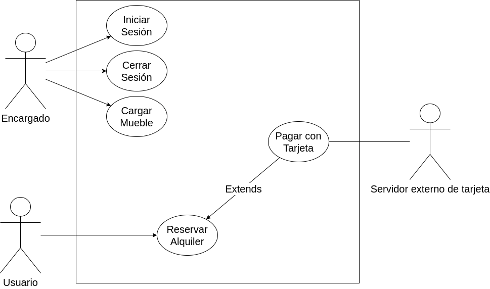

## Problema 1: Alquiler de mobiliario.

Suponga que trabaja en una consultora la cual ha sido recientemente contactada por una empresa de alquiler de mobiliario para eventos para la realización de una app. 
De las diferentes entrevistas se ha obtenido la siguiente información:

El gerente nos dijo que resulta fundamental tener una aplicación móvil que nos permita manejar la agenda de la empresa, sabiendo qué disponibilidad tenemos y permitiendo que nuestros clientes alquilen a través de la app. Para esta primera versión de la app, el gerente nos pidió que sea posible dar de alta los diferentes mobiliarios, así como la posibilidad de que los usuarios puedan realizar una reserva de alquiler desde sus dispositivos. Para el detalle de cómo se realiza la carga de los muebles, el gerente nos sugirió hablar con el encargado del departamento de mobiliario. El encargado de mobiliario nos comentó que de cada mueble se debe cargar código de inventario, tipo de mueble, fecha de creación, fecha de último mantenimiento, estado (libre, de baja, alquilado) y el precio de alquiler. Además, no pueden existir códigos repetidos y por
el contrato de la franquicia, el precio debe cargarse en dólares. Para que el encargado pueda dar de alta el mobiliario debe autenticarse en el sistema. El registro de los usuarios de carga no debe modelarse.

El encargado del departamento de alquileres no comentó acerca de las reservas de los alquileres. Por una política comercial de la marca una reserva tiene que incluir como mínimo 3 muebles. La reserva debe tener una fecha, lugar del evento, cantidad de días y mobiliario junto a su cantidad. Para realizar una reserva se debe abonar el 20% del total del alquiler. El pago de la reserva se realiza únicamente con tarjeta de crédito validando número de tarjeta y fondos a través de un servicio del banco. Luego de efectuado el pago, se emite un número de reserva único que será luego utilizado por el cliente para hacer efectivo el alquiler.

___

**Actores:**

- Usuarios.

- Encargado de mobiliario.

- Servicios del banco.

**Casos de Usos**

- Iniciar de Sesión.

- Cerrar Sesión.

- Cargar mueble.

- Reservar alquiler.

- Pagar con tarjeta.

___

#### Nombre del caso de uso:

- Iniciar Sesión.

**Descripción:** 

- Especifica el modo en el que el encargado de mobiliario se autentifica con su nombre de usuario y contraseña.

**Actores:** 

- Encargado de mobiliario.

**Precondiciones:**

- 

**Curso Normal:**

- **Acción del Actor:**

	- Paso 1: El encargado de mobiliario selecciona la opción de iniciar sesión.
	
	- Paso 3: el encargado ingresa los datos.

- **Acciones del Sistema:**

	- Paso 2: el sistema solicita usuario y contraseña.
	
	- Paso 4: el sistema hace la verificación de los datos ingresados.
	
	- Paso 5: el sistema registra el inicio de sesión y habilita las funciones del encargado de mobiliario.

**Curso Alterno:**

- Paso alternativo 4: el nombre de usuario o la contraseña no son válidos. Se notifica y se retorna al paso 2.

**Postcondición:**

- La sesión es iniciada y se habilitan las opciones para el encargado de mobiliario.

___

#### Nombre del caso de uso:

- Cerrar Sesión.

**Descripción:** 

- Especifica como el encargado de mobiliario cierra la sesión.

**Actores:** 

- Encargado de mobiliario.

**Precondiciones:**

- Debe tener una sesión iniciada.

**Curso Normal:**

- **Acción del Actor:**

	- Paso 1: el mobiliario selecciona la opción de cerrar sesión.
	
	- Paso 3: el mobiliario confirma el cierre de su sesión

- **Acciones del Sistema:**

	- Paso 2: el sistema solicita la confirmación del usuario
	
	- Paso 4: el sistema cierra la sesión y deshabilita las acciones del usuario

**Curso Alterno:**

- Paso alternativo 3: el encargado de mobiliario cancela el cierre de su sesión. Termina el CU.

**Postcondición:**

- La sesión es cerrada, las opciones para el encargado de mobiliario desaparecen y los datos de sesión son eliminados.

___

#### Nombre del caso de uso:

- Cargar muebles

**Descripción:** 

- Este caso de uso describe el evento donde el encargado de mobiliario carga un mueble.

**Actores:** 

- Encargado de mobiliario

**Precondiciones:** 

- El encargado debe estar autenticado

**Curso Normal:** 

- **Acción del Actor:**

	- Paso 1: El mobiliario autenticado selecciona la opción de "Cargar Mueble".
	
	- Paso 3: el mobiliario ingresa los datos
	
- **Acciones del Sistema:**
	- Paso 2: El sistema muestra la información de carga de datos del mueble: "código de inventario", "tipo de mueble", "fecha de cración", "fecha de último mantenimiento", "estado", "precio del alquiler".
	
	- Paso 4: el sistema verifica que el "código de inventario" no se encuentre cargado
	
	- Paso 5: el sistema carga el mueble.	
	
**Curso Alterno:**

- Paso alternativo 4: el código de inventario ya se encuentra cargado. Se notifica y se vuelve a retomar desde el paso 3.

**Postcondición:** 

- Se hace la carga de un mueble.

___

#### Nombre del caso de uso:

- Reservar alquiler.

**Descripción:** 

- Este Caso de Uso describe el evento en el que un Usuario hace la Reserva de un alquiler.

**Actores:**

- Usuario 

**Precondiciones:**

- 

**Curso Normal:**

- **Acción del Actor:**
	- Paso 1: El usuario selecciona la opción de "Hacer reserva"
	
	- Paso 3: el usuario ingresa los datos de la reserva.
	
	- Paso 5: el usuario selecciona la opción de "Pagar"
	

- **Acciones del Sistema:**
	- Paso 2: El sistema muestra la información de carga de la reserva: "fecha", "lugar del evento", "cantidad de días", "mueble con su cantidad disponible".
	
	- Paso 4: el sistema verifica la cantidad mínima de muebles para la reserva
	
	- Paso 6: el sistema ejecuta el Caso de Uso "Pagar con tajeta"

**Curso Alterno:**

- Paso alternativo 4: No se supera la cantidad mínima de muebles. Se notifica y se vuelve a retomar desde el paso 3.

**Postcondición:**

- Se hace la reserva de un alquiler.

___

#### Nombre del caso de uso:

- Pagar con tarjeta.

**Descripción:** 

- Especifica la realización del pago con tarjeta de crédito por parte del usuario

**Actores:** 

- Usuario
- Servicio del banco

**Precondiciones:**

- Haber realizado una reserva.

**Curso Normal:**

- **Acción del Actor:**
	- Paso 2: el usuario ingresa los datos de la tarjeta y el monto
	
	- Paso 4: el servicio del banco acepta la conexión y solicita los datos del pago
	
	- Paso 6: el servicio del banco valida los datos de la tarjeta y los fondos de la cuenta
	
	- Paso 7: el servicio retorna el resultado

- **Acciones del Sistema:**
	- Paso 1: El sistema solicita el número de tarjeta y el monto a pagar por la reserva.
	
	- Paso 3: el sistema solicita la conexión con el servicio del banco
	
	- Paso 5: el sistema envía los datos del pago
	
	- Paso 8: el sistema recibe que los datos de la tarjeta son correctos.
	
	- Paso 9: el sistema recibe que la cuenta tiene fondos suficientes.
	
	- Paso 10: el sistema registra el pago y cierra la conexión con el servidor externo.
	
	
**Curso Alterno:**

- Paso alternativo 4: el servicio del banco rechaza la conexión. Se informa el error y termina el CU.

- Paso alternativo 8: los datos de la tarjeta no son válidos. Se informa el error de validación y termina el CU.

- Paso alternativo 9: la cuenta no tiene fondos suficientes. Se informa el problema y termina el CU.

**Postcondición:**

- Se efectuó y registró el pago a través de tarjeta de crédito
