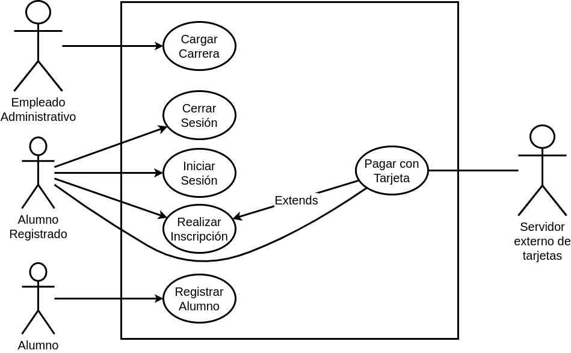

## Problema 2: Posgrado.

___

**Actores:**

- Empleado administrativo
- Alumno registrado
- Alumno no registrado

**Casos de Usos**

- Cargar Carrera.
- Realizar Inscripción.
- Pagar con Tarjeta.
- Registrar Alumno.
- Iniciar Sesión.
- Cerrar Sesión.

___

#### Nombre del caso de uso:

- Cargar Carrera.

**Descripción:**

- Este caso describe el evento en el que el Empleado adminsitrativo carga una carrera.

**Actores:**

- Empleado administrativo

**Precondiciones:**

- 

**Curso Normal:**

- **Acción del Actor:**

	- Paso 1: El empleado selecciona "Cargar Carrera"
	
	- Paso 3: el empleado carga los datos de la carrera
	
	- Paso 5: el empleado completa el nombre de la carrera y la duración de la misma.

- **Acciones del Sistema:**

	- Paso 2: el sistema solicita los datos de la carrera que se va a cargar
	
	- Paso 4: el sistema solicita nombre único de carrera y que la duración sea menor a 5 años
	
	- Paso 6: el sistema verifica que el nombre de la carrera sea único y la duración sea menor a 5 años
	
	- Paso 7: el sistema carga la carrera

**Curso Alterno:**

- Paso alternativo 6: El nombre de la carrera ya existe. Se notifica y se vuelve al paso 4.

- Paso alternativo 6: La duración de la  carrera supera los 5 años. Se notifica y se vuelve al paso 4

**Postcondición:**

- Se carga una carrera al sistema.

___

**Nombre del caso de uso:**

- Realizar Inscripción.

**Descripción:** 

- Describe el evento en el que el Alumno registrado selecciona una carrera.

**Actores:** 

- Alumno registrado

**Precondiciones:**

- El Alumno debe tener la sesión iniciada.

**Curso Normal:**

- **Acción del Actor:**

	- Paso 1: el alumno selecciona la opción de "Mostrar carreras"
	
	- Paso 3: el alumno selecciona una de las carreras del listado.
	
	- Paso 5: el alumno selecciona la opción de "Realizar Pago"
	

- **Acciones del Sistema:**

	- Paso 2: el sistema muestra un listado con las carreras disponibles.
	
	- Paso 4: el sistema habilita la opción "Realizar Pago"
	
	- Paso 6: el sistema ejecuta el Caso de Uso "Pagar con tarjeta"

**Curso Alterno:**

- Paso alternativo 2: el sistema no muestra un listado de carreras porque no hay. Se notifica y termina el Caso de Uso.

**Postcondición:**

- Se selecciono la carrera.

___

**Nombre del caso de uso:**

- Pagar con Tarjeta.

**Descripción:** 

- Describe el cobro de la incripción a la carrera.

**Actores:** 

- Servidor externo
- Alumno Registrado

**Precondiciones:**

- Haber ejecutado el Caso de Uso "Realizar Inscripción".

**Curso Normal:**

- **Acción del Actor:**

	- Paso 2: el alumno registrado ingresa las cuotas a pagar
	
	- Paso 4: el alumno registrado ingresa los datos de la tarjeta
	
	- Paso 6: el servidor externo acepta la conexión y solicita los datos de la tarjeta
	
	- Paso 8: el servidor externo valida los datos de la tarjeta de crédito
	
	- Paso 9: el servidor externo retorna el resultado
	

- **Acciones del Sistema:**

	- Paso 1: El sistema solicita las cuotas a pagar
	
	- Paso 3: el sistema solicita los datos de la tarjeta
	
	- Paso 5: el sistema establece la conexión con el servidor externo
	
	- Paso 7: el sistema envía los datos de la tarjeta al servidor externo
	
	- Paso 10: el sistema recibe que los datos de la tarjeta son correctos
	
	- Paso 11: el sistema recibe que la tarjeta posee fondos suficientes
	
	- Paso 12: el sistema registra el paso y cierra la conexión con el servidor externo
	

**Curso Alterno:**

- Paso alternativo 5: no se peude establecer conexión con el servidor externo. Se notifica y termina el Caso de Uso.

- Paso alternativo 10: el sistema recibe que los datos de la validacion son incorrectos. Se informa error de validación y se retorna al paso 3.

- Paso alternativo 11: el sistema recibe que la tarjeta no posee fondos suficientes. Se notifica y termina el Caso de Uso

**Postcondición:**

- Se completa el pago y se hace la inscripción

___

#### Nombre del caso de uso:

- Registrar Alumno

**Descripción:** 

- Este Caso de Uso describe el evento en el que un Alumno no registrado se registra en el sistema.

**Actores:**

- Alumno no registrado

**Precondiciones:**

-

**Curso Normal:**

- **Acción del Actor:**

	- Paso 1: El alumno no registrado selecciona la opción de "Registrarse"
	
	- Paso 3: el alumno no registrado ingresa los datos solicitados
	
	- Paso 5: el alumno no registrado completa el nombre usuario y contraseña

- **Acciones del Sistema:**

	- Paso 2: el sistema solicita los datos de registro del alumno.
	
	- Paso 4: el sistema solicita nombre de usuario único y contraseña de más de 6 dígitos
	
	- Paso 6: el sistema verifica que el nombre de usuario sea único y la contraseña contenga más de 6 dígitos
	
	- Paso 7: se registra el alumno.

**Curso Alterno:**

- Paso alternativo 6: Ya existe el nombre de usuario ingresado. Se notifica y se vuelve al paso 4.

- Paso alternativo 6: La contraseña no contiene más de 6 dígitos. Se notifica y se vuelve al paso 4.

**Postcondición:**

- Se crea una cuenta nueva.

___

#### Nombre del caso de uso:

- Iniciar Sesión.

**Descripción:** 

- Especifica el modo en el que un Alumno registrado inicia sesión con su nombre de usuario y contraseña.

**Actores:** 

- Alumno registrado

**Precondiciones:**

- 

**Curso Normal:**

- **Acción del Actor:**

	- Paso 1: El Alumno Registrado selecciona la opción de "Iniciar Sesión"
	
	- Paso 3: el alumno ingresa el nombre de usuario y contraseña

- **Acciones del Sistema:**

	- Paso 2: el sistema solicita nombre de usuario y contraseña
	
	- Paso 4: el sistema verifica los datos ingresados

**Curso Alterno:**

- Paso alternativo 4: el nombre de usuario no es correcto. Se informa y finaliza el CU.

- Paso alternativo 4: la contraseña ingresada no es correcta. Se informa y finaliza el CU.

**Postcondición:**

- Se registra el inicio de sesión y se habilitan las funciones del alumno registrado

___

#### Nombre del caso de uso:

- Cerrar Sesión.

**Descripción:** 

- Describe el evento en el que un usuario registrado cierra la sesión.

**Actores:** 

- Alumno registrado

**Precondiciones:**

- El Alumno Registrado debe tener la sesión iniciada

**Curso Normal:**

- **Acción del Actor:**

	- Paso 1: El Alumno Registrado selecciona la opción de "Cerrar Sesión"
	
	- Paso 3: el alumno confirma el cierre de la sesión

- **Acciones del Sistema:**

	- Paso 2: el sistema solicita la confirmación del cierre de Sesión al alumno
	
	- Paso 4: el sistema cierra la sesión del alumno y deshabilita todas las funciones del alumno registrado.

**Curso Alterno:**

- Paso alternativo 3: el alumno cancela la operación. Fin de CU

**Postcondición:**

- Se cierra sesión y se deshabilitan todas las funciones del Usuario Registrado.

