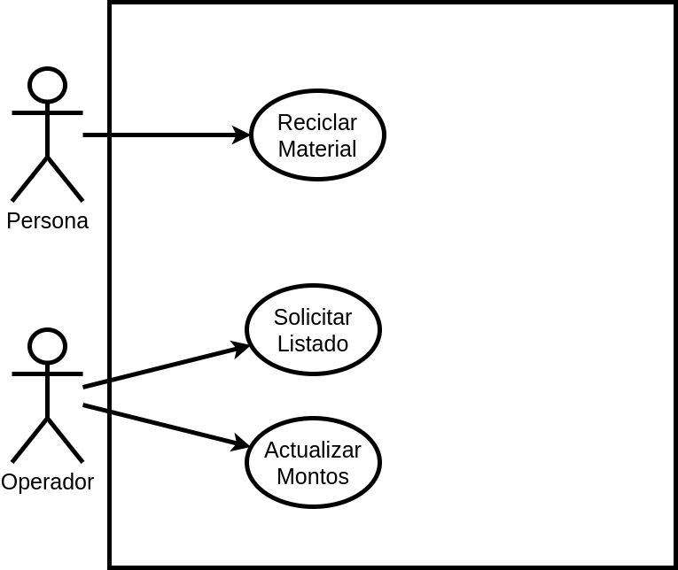

## Problema 4: Máquina de reciclado.
Se desea modelar un sistema que controle una máquina de reciclado. La máquina cuenta con un recipiente externo donde se depositan los materiales a reciclar (vidrio, papel, plástico o aluminio). La persona coloca lo que desea reciclar en el recipiente y luego presiona la opción “reciclar”. El sistema detecta el tipo de material y registra el peso; por último imprime un recibo con el monto total que se le debe pagar a la persona por lo reciclado. Si el sistema no detecta correctamente el tipo de material aborta el proceso retornando el producto.

El sistema también es utilizado por un operador a través de una consola que se encuentra bajo llave. El operador puede solicitar un listado con los tipos de materiales reciclados en un periodo de fechas determinado, detallando además el total abonado por dicho material. También, el operador puede actualizar los montos a pagar por kilo de cada tipo de material que la máquina puede reciclar. Para esto, el sistema primero solicita el tipo de material a actualizar. Luego se pide el nuevo monto. Si el operador acepta, se actualiza el material seleccionado.

**Actores:**

- Persona

- Operador

**Casos de Usos**

- Reciclar Material.

- Solicitar Listado.

- Actualizar Montos.

___

#### Nombre del caso de uso:

- Reciclar material.

**Descripción:** 

- Este Caso de Uso describe el evento en el que una persona recicla un material.

**Actores:** 

- Persona

**Precondiciones:**

- 

**Curso Normal:**

- **Acción del Actor:**

	- Paso 1: La Persona selecciona la opción "Reciclar"

- **Acciones del Sistema:**

	- Paso 2: el sistema detecta el tipo de material
	
	- Paso 3: el sistema registra el peso del material
	
	- Paso 4: el sistema registra el material reciclado
	
	- Paso 5: el sistema imprime un recibo con el monto total de lo reciclado.

**Curso Alterno:**

- Paso alternativo 2: El sistema no detecta el material. Se notifica. Se aborta el proceso y retorna el producto.

- Paso alternativo 5: No se detecta correctamente el material, se aborta el proceso y se retorna el producto. Se informa y finaliza el CU.

**Postcondición:**

- Se hace el reciclado del material calculando el monto que se le debe pagar a la persona por el reciclado.

___

#### Nombre del caso de uso:

- Solicitar listado.

**Descripción:** 

- Este Caso de Uso describe el evento en el que el Operador solicita un listado de los tipos de materiales reciclados.

**Actores:** 

- Operador

**Precondiciones:**

-

**Curso Normal:**

- **Acción del Actor:**

	- Paso 1: El operador selecciona la opción de "Solicitar Listado"
	
	- Paso 3: el operador ingresa las fechas
	

- **Acciones del Sistema:**

	- Paso 2: el sistema solicita las fechas de un periodo determinado
	
	- Paso 4: el sistema verifica que las fechas ingresadas sean válidas
	
	- Paso 5: el sistema imprime el listado detallando además el total abonado por los materiales

**Curso Alterno:**

- Paso alternativo 4: las fechas ingresadas no son válidas. Se notifica y se retorna al paso 2.

- Paso alternativo 5: no se reciclaron materiales en esas fechas. Se informa y finaliza el CU.

**Postcondición:**

- Se imprime listado con los tipos de materiales reciclados en el rango de las fechas ingresadas.

___

#### Nombre del caso de uso:

- Actualizar montos

**Descripción:** 

- Este Caso de Uso describe el evento en el que el operador actualiza los montos a pagar por kilo de cada tipo de material.

**Actores:** 

- Operador.

**Precondiciones:**

- 

**Curso Normal:**

- **Acción del Actor:**

	- Paso 1: El operador selecciona "Actualizar Montos"
	
	- Paso 3: el operador selecciona el tipo de material que quiere actualizar
	
	- Paso 5: el operador ingresa el nuevo monto del material
	
	- Paso 7: el operador selecciona que quiere actualizar el nuevo monto

- **Acciones del Sistema:**

	- Paso 2: El sistema muestra los tipos de materiales reciclables
	
	- Paso 4: el sistema solicita el nuevo monto del material
	
	- Paso 6: el sistema informa si desea actualizar el nuevo monto
	
	- Paso 8: el sistema registra el nuevo monto del material.
	

**Curso Alterno:**

- Paso alternativo 7: El operador selecciona la opción de que no quiere actualizar el monto. Fin de Caso de Uso.

**Postcondición:**

- Se actualiza el precio por kilo del material.
