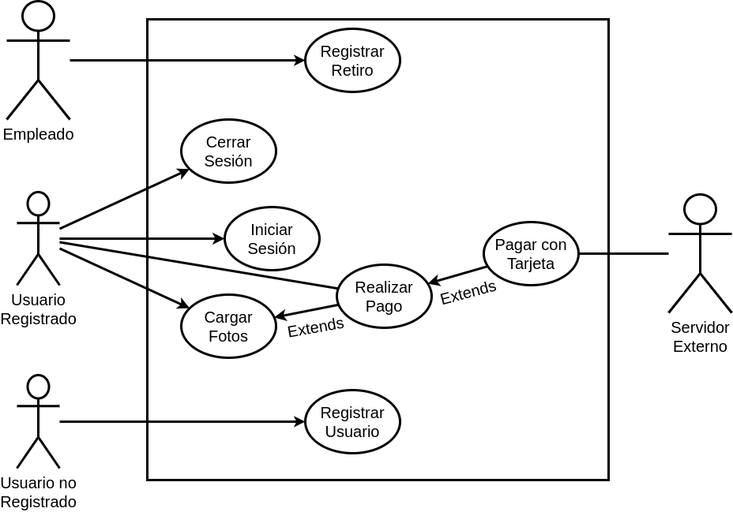

## Problema 5: Impresión de fotos.

**Actores:**

- Usuario no registrado
- Usuario registrado
- Servidor externo
- Empleado

**Casos de Usos**

- Cargar Imágenes.
- Realizar Pago.
- Retirar Fotos.
- Registrar Usuario
- Iniciar Sesión
- Cerrar Sesión

___

#### Nombre del caso de uso:

- Cargar Imágenes

**Descripción:** 

- Este caso de uso describe el evento en el que un usuario registrado sube fotos al sistema.

**Actores:** 

- Usuario Registrado

**Precondiciones:**

- El usuario debe tener una sesión iniciada.

**Curso Normal:**

- **Acción del Actor:**

	- Paso 1: El Usuario Registrado selecciona la opción de "Subir Imagen"
	
	- Paso 4: el usuario sube una imagen
	
	- Paso 6: el usuario selecciona la opción de "Realizar Pago"

- **Acciones del Sistema:**

	- Paso 2: el sistema verifica la cantidad de imágenes ingresadas
	
	- Paso 3: el sistema solicita el ingreso de una imagen
	
	- Paso 5: el sistema solicita que seleccione una opción "Subir foto" o "Realizar Pago"
	
	- Paso 7: el sistema se ejecuta el CU "Realizar Pago".
	
	
**Curso Alterno:**

- Paso alternativo 2: la cantidad de imágenes ingresadas llegó al máximo permitido. Se notifica y salta al paso 7.

- Paso alternativo 6: el usuario registrado seleccioan la opción de "Subir Foto". Se retorna al paso 2.

- Paso alternativo 7: no se registra el pago. Se notifica y finaliza el CU
	
**Postcondición:**

- Se hace la carga de imágenes.

___

**Nombre del caso de uso:**

- Realizar Pago

**Descripción:** 

- Este caso de Uso describe el evento en el que el Usuario Registrado recibe el código de retiro de imágenes.

**Actores:** 

- Usuario Registrado.

**Precondiciones:**

- Haber ejecutado el Caso de Uso: Cargar Fotos.

**Curso Normal:**

- **Acción del Actor:**

	- 
	
	-

- **Acciones del Sistema:**

	- Paso 1: El sistema calcula el monto de las imágenes cargadas.
	
	-

**Curso Alterno:**

**Postcondición:**

- Se hace el registro del Pago y la entrega del ćodigo de retiro de las imágenes.

___

#### Nombre del caso:

- Pagar con Tarjeta

**Descripción**

- Este Caso de Uso describe el evento en el que un Usuario Registrado hace el pago de las imágenes

**Actores**

- Usuario registrado
- Servidor externo

**Precondiciones**

- Haber ejecutado el Caso de Uso: Subir Fotos.

**Curso Normal:**

- **Acción del Actor:**

	- Paso 2: el usuario ingresa los datos de la tarjeta
	
	- Paso 4: el sistema externo acepta la conexión
	
	- Paso 6: el servidor externo valida los datos y los fondos de la cuenta
	
	- Paso 7: el servidor externo envía los datos

- **Acciones del Sistema:**

	- Paso 1: El sistema solicita los datos de la tarjeta
	
	- Paso 3: el sistema establece conexión con el servidor externo
	
	- Paso 5: el sistema envía los datos de las tarjeta
	
	- Paso 8: el sistema recibe que los datos de la tarjeta son correctos
	
	- Paso 9: el sistema recibe que la cuenta tiene fondos
	
	- Paso 10: el sistema registra el pago y cierra la conexión con el servidor externo

**Curso Alterno:**

- Paso alternativo 3: Falla la conexión con el servidor externo. Se notifica y termina el Caso de Uso.

- Paso alternativo 8: los datos de la tarjeta son incorrectos. Se notifica y se retorna al paso 1.

- Paso alternativo 9: la cuenta no tiene fondos suficientes. Se notifica y termina el Caso de Uso.

**Postcondición:**

- Se efectúa el pago de las imágenes con tarjeta de crédito.

___

#### Nombre del caso:

- Registrar retiro

**Descripción**

- Este Caso de uso describe el evento en el que el empleado registra el retiro de las imágenes

**Actores**

- Empleado

**Precondiciones**

- 

**Curso Normal:**

- **Acción del Actor:**

	- Paso 1: el empleado selecciona "Registrar código de retiro"
	
	- Paso 3: el empleado ingresa el código provisto
	
	- Paso 6: el empleado ingresa la fecha de retiro de las imágenes

- **Acciones del Sistema:**

	- Paso 2: el sistema solicita el código único de retiro
	
	- Paso 4: el sistema verifica el código ingresado
	
	- Paso 5: el sistema solicita la fecha del retiro
	
	- Paso 7: el sistema verifica la fecha
	
	- Paso 8: se registra el retiro de las imágenes

**Curso Alterno:**

- Paso alternativo 4: el código ingresado no corresponde a un código único. Se notifica y se vuelve al paso 2

- Paso alternativo 6: la fecha ingresada es incorrecta. Se notifica y se vuelve al paso 5

**Postcondición:**

 Se registra el retiro de las imágenes.

___

#### Nombre del caso de uso:

- Registrar Usuario

**Descripción:** 

- Este Caso de Uso describe el evento en el que una persona se registra en el sitema

**Actores:** 

- Usuario no registrado

**Precondiciones:**

- 

**Curso Normal:**

- **Acción del Actor:**

	- Paso 1: El usuario no registrado selecciona la opción de "Registrarse"
	
	- Paso 3: el usuario ingresa los datos solicitados
	
	- Paso 5: el usuario ingresa el email, nombre de usuario y contraseña.

- **Acciones del Sistema:**

	- Paso 2: el sistema solicita los datos de la persona
	
	- Paso 4: el sistema pide email, nombre de usuario único y contraseña.
	
	- Paso 6: el sistema verifica los datos ingresados

**Curso Alterno:**

- Paso alternativo 6: el email ingresado no es válido. Se notifica y se vuelve al paso 4.
	
- Paso alternativo 6: el nombre de usuario ya existe en el sistema. Se notifica y se vuelve al paso 4.
	
- Paso alternativo 6: la contraseña ingresada es demasiado corta o no cumple con los caracteres solicitados. Se notifica y se vuelve al paso 4.

**Postcondición:**

- Se registra una persona en el sistema.

___

#### Nombre del caso:

- Iniciar Sesión

**Descripción**

- Este Caso de Uso especifica el evento en el que un Usuario registrado inicia la sesíon con su nombre y contraseña.

**Actores**

- 

**Precondiciones**

- 

**Curso Normal:**

- **Acción del Actor:**

	-
	
	-

- **Acciones del Sistema:**

	-
	
	-

**Curso Alterno:**

**Postcondición:**

- Se inicia la sesión y se habilitan las opciones para los usuarios registrados.

___

#### Nombre del caso:

- Cerrar Sesión

**Descripción**

- Este Caso de Uso especifica el evento en el que un Usuario registrado cierra la sesíon.

**Actores**

- Usuario registrado

**Precondiciones**

- El usuario debe tener la sesión iniciada.

**Curso Normal:**

- **Acción del Actor:**

	-
	
	-

- **Acciones del Sistema:**

	-
	
	-

**Curso Alterno:**

**Postcondición:**

- La sesión es cerrada y se deshabilitan las opciones para el usuario registrado eliminando los datos de la sesińo.

