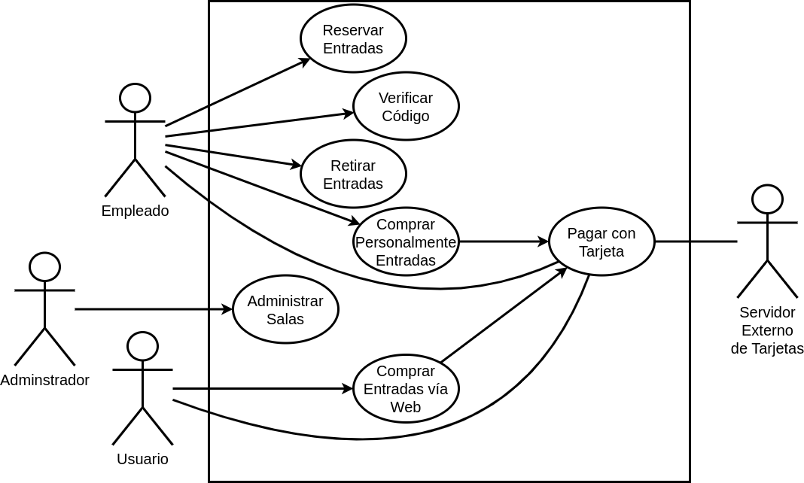

## Problema 06: Venta de Entradas para Teatro.

Se desea modelar un sistema de gestión de ventas de entradas para un teatro. Las personas compran sus entradas a través de una página web, o personalmente.
El sistema permite, sólo de modo personal en el teatro, la reserva de entradas de forma gratuita. El empleado debe ingresar los datos de la obra (fecha, hora, y nombre) junto el nombre y DNI del espectador. En este caso, sólo se podrá reservar hasta 2 entradas. Las entradas reservadas no compradas caducarán tres horas antes del evento. Para seleccionar el nombre de la obra, el sistema muestra una grilla de funciones disponibles para que el usuario seleccione una.

Para comprar una entrada vía web, el sistema muestra la grilla de funciones disponibles. El usuario selecciona una opción, ingresa su DNI, la cantidad de lugares solicitados y selecciona la opción “pagar”. El pago se realiza con tarjeta de crédito. Para esto debe ser autorizada a través del sistema del banco. Este pide el número de tarjeta, vencimiento, y código de seguridad. Verifica todos los campos y autoriza la compra. Autorizada la tarjeta, se emite un código de compra con el que el cliente podrá retirar sus entradas en la boletería del cine.

Para comprar una entrada personalmente, el vendedor de la boletería solicita los datos de la función al cliente, procediendo de un modo similar a la compra web, con la diferencia que en este caso no se muestra el código de compra sino que se imprimen directamente la/s entrada/s. El pago es únicamente con tarjeta de crédito, igual que en el caso anterior.

Para retirar las entradas reservadas previamente, el empleado solicita nombre y DNI del espectador, el sistema valida que la persona posea entradas reservadas, y que no estén caducas. El resto del procedimiento se realiza igual que la compra de entradas descriptas anteriormente.

Cuando una persona llega con el código de compra, el vendedor debe ingresar el código para que el
sistema, luego de verificarlo, imprima las entradas correspondientes.

Además se desea administrar la programación de las salas. El administrador ingresa la distribución semanal
de las obras en las salas de manera que se encuentre disponible para la realización de la venta de entradas.

**Actores:**

- Empleado

- Usuario

- Servidor Externo de tarjetas

- Administrador

**Casos de Usos**

- Reservar Entradas

- Comprar Entradas via Web

- Comprar Entradas Personalmente

- Retirar Entradas

- Verificar Código	

- Pagar con Tarjeta

___

#### Nombre del caso

- Reservar Entradas.

**Descripción**

- Este Caso de Uso describe el evento en el que un Empleado hace la reserva de entradas.

**Actores**

- Empleado

**Precondiciones**

- 

**Curso Normal:**

- **Acción del Actor:**

	- Paso 2: el Empleado ingresa los datos de la persona
	
	- Paso 4: el Empleado selecciona una opción	
	
	- Paso 6: el empleado ingresa la cantidad de entradas

- **Acciones del Sistema:**

	- Paso 1: El Sistema solicita los datos de la persona
	
	- Paso 3: el Sistema muestra una grilla de funciones disponibles
	
	- Paso 5: el sistema solicita la cantidad de entradas
	
	- Paso 7: el sistema verifica la cantidad de entradas de la persona
	
	- Paso 8: el sistema registra la reserva de las entradas.
	

**Curso Alterno:**

- Paso alternativo 3: No hay funciones disponibles. Se informa y termina el Caso de Uso.

- Paso alternativo 7: la cantidad de entradas de la persona superan el máximo de 2. Se notifica y se termina el CU.

**Postcondición:**

- Se hace la reserva de entradas.

___

#### Nombre del caso

- Comprar Entradas via Web.

**Descripción**

- Este Caso de Uso describe el evento en el que un Usuario elige una función e ingresa sus datos para comprar entradas.

**Actores**

- Usuario

**Precondiciones**

- 

**Curso Normal:**

- **Acción del Actor:**

	- Paso 1: El Usuario selecciona la opción de "Comprar Entradas"
	
	- Paso 3: el Usuario selecciona una opción
	
	- Paso 5: el Usuario ingresa los datos solicitados
	
	- Paso 7: el Usuario selecciona los lugares disponibles
	
	- Paso 8: el Usuario selecciona la opción de "Pagar"

- **Acciones del Sistema:**

	- Paso 2: el Sistema muestra la grilla de funciones disponibles
	
	- Paso 4: el Sistema solicita los datos del Usuario
	
	- Paso 6: el Sistema muestra los lugares disponible
	
	- Paso 9: el Sistema ejecuta el Caso de Uso "Pagar con Tarjeta"
	
	- Paso 10: el Sistema registra la compra de las entradas y emite un código de compra.
	

**Curso Alterno:**

- Paso alternativo 2: No hay funciones disponibles. Se notifica y se termina el Caso de Uso.

- Paso alternativo 6: No hay lugares disponibles. Se notifica y se termina el Caso de Uso.

- Paso alternativo 9: No se realiza el pago. Se notifica y se termina el Caso de Uso.

**Postcondición:**

- Se emite un código de compra para retirar las entradas.

___

#### Nombre del caso

- Comprar Entradas Personalmente.

**Descripción**

- Este Caso de Uso describe el evento en el que un Empleado solicita los datos de una persona para la compra de las entradas.

**Actores**

- Empleado

**Precondiciones**

- 

**Curso Normal:**

- **Acción del Actor:**

	- Paso 1: El Empleado selecciona la opción de "Vender Entradas"
	
	- Paso 3: el empleado selecciona una función
	
	- Paso 5: el empleado ingresa los datos solicitados
	
	- Paso 7: el empleado selecciona los lugares disponibles
	
	- Paso 8: el empleado selecciona la opción de "Pagar"

- **Acciones del Sistema:**

	- Paso 2: el sistema muestra una grilla con las funciones disponibles
	
	- Paso 4: el Sistema solicita los datos de la persona
	
	- Paso 6: el Sistema muestra los lugares disponible
	
	- Paso 9: el Sistema ejecuta el Caso de Uso "Pagar con Tarjeta"
	
	- Paso 10: el Sistema registra la compra de las entradas y emite un código de compra.

**Curso Alterno:**

- Paso alternativo 2: No hay funciones disponibles, se notifica y finaliza el CU.

- Paso alternativo 6: No hay lugares disponibles. Se informa y finaliza el CU.

- Paso alternativo 9: No se pudo realizar el pago. Se notifica y finaliza el CU.

**Postcondición:**

- Se venden entredas disponibles.

___

#### Nombre del caso

- Retirar Entradas

**Descripción**

- Este Caso de Uso describe el evento en el que se compran las entradas reservadas.

**Actores**

- Empleado

**Precondiciones**

**Curso Normal:**

- **Acción del Actor:**

	- Paso 1: El Empleado selecciona "Retirar Entradas"

	- Paso 3: el empleado ingresa los datos de la persona
	

- **Acciones del Sistema:**

	- Paso 2: El sistema solicita los datos de la persona
	
	- Paso 4: el sistema valida que la persona registre entradas
	
	- Paso 5: el sistema valida el horario antes de la función
	
	- Paso 6: el sistema ejecuta el Caso de Uso "Pagar con Tarjeta"
	
	- Paso 7: el sistema imprime las entradas compradas

**Curso Alterno:**

- Paso alternativo 4: la persona no registra entradas. Se notifica y finaliza el Caso de Uso.

- Paso alternativo 5: las entradas están caducadas. Se notifica y finaliza el Caso de Uso.

**Postcondición:**

- Se compran las entradas reservadas.

___

#### Nombre del caso

- Verificar Código.

**Descripción**

- Este Caso de Uso describe el evento en el que el Empleado verifica el código de retiro de entradas.

**Actores**

- Empleado

**Precondiciones**

**Curso Normal:**

- **Acción del Actor:**

	- Paso 1: El Empleado selecciona la opción de "Verificar Código"
	
	- Paso 3: el empleado ingresa el código

- **Acciones del Sistema:**

	- Paso 2: el sistema solicita el código
	
	- Paso 4: el sistema verifica el código ingresado
	
	- Paso 5: el sistema imprime las entradas

**Curso Alterno:**

- Paso alternativo 4: el código ingresado es incorrecto. Se notifica y termina CU.

**Postcondición:**

- Se imprimen las entradas.

___

#### Nombre del caso

- Pagar con Tarjeta.

**Descripción**

- Este Caso de Uso describe el evento en el que se paga por la compra de entradas.

**Actores**

- Servidor Externo de tarjetas, Usuario o Empleado.

**Precondiciones**

- Haber ejecutado el CU "Comprar Entradas vía Web" o "Comprar Entradas Personalmente"

**Curso Normal:**

- **Acción del Actor:**

	- Paso 2: el Usuario o Empleado ingresa los datos de la tarjeta
	
	- Paso 4: el Servidor Externo de Tarjetas acepta la conexión
	
	- Paso 5: el Servidor Externo de Tarjetas solicita los datos de la tarjeta
	
	- Paso 7: el Servidor Externo valida los datos de la tarjeta y los fondos de la misma
	
	- Paso 8: el Servidor Externo retorna el resultado

- **Acciones del Sistema:**

	- Paso 1: El sistema solicita los datos de la tarjeta
	
	- Paso 3: el sistema se conecta con el Servidor Externo de Tarjetas
	
	- Paso 6: el sistema envía los datos de la tarjeta
	
	- Paso 9: el sistema recibe que los datos de la tarjeta son correctos.
	
	- Paso 10: el sistema recibe que la tarjeta posee fondos suficientes
	
	- Paso 11: el sistema registra el pago y finaliza la conexión con el Servidor Externo.

**Curso Alterno:**

- Paso alternativo 3: No se puede establecer conexión con el Servidor Externo. Se informa y finaliza el CU.

- Paso alternativo 9: Los datos de la tarjeta son incorrectos, se informa y finaliza el CU.

- Paso alternativo 10: La tarjeta no posee fondos suficientes. Se notifica y fin del CU.

**Postcondición:**

- Se efectúa el registro y el pago de las entradas.

___

#### Nombre del caso

- Administrar Salas.

**Descripción**

- Este Caso de Uso describe el evento en el que se cargan las obras en la grilla.

**Actores**

- Administrador de Salas.

**Precondiciones**

**Curso Normal:**

- **Acción del Actor:**

	- Paso 1: El Administrador selecciona la opción de "Administrar Salas"
	
	- Paso 3: el Administrador ingresa las obra

- **Acciones del Sistema:**

	- Paso 2: el sistema solicita la distribución semanal
	
	- Paso 4: el sistema registra la obra y la carga en la grilla

**Curso Alterno:**

-

**Postcondición:**

- Se Carga una obra en la grilla.

