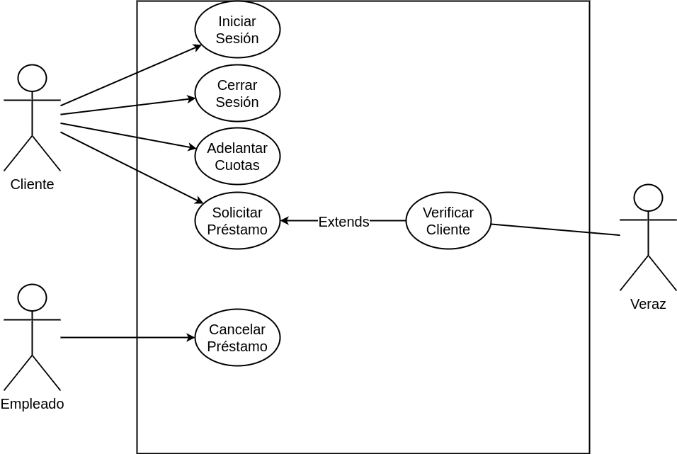

##Problema 7: Préstamos Personales.

___

**Actores:**

- Cliente

- Empleado

- Servidor Externo

**Casos de Usos**

- Solicitar Préstamo via web

- Verificar Cliente

- Adelantar cuotas

- Cancelar Préstamo

- Iniciar Sesión

- Cerrar Sesión
___

**Nombre del caso de uso:**

- Solicitar Préstamo vía web

**Descripción:** 

- Este Caso de Uso describe el evento en el que un cliente solicita un préstamo personal a través de la web.

**Actores:** 

- Cliente

**Precondiciones:**

- El Cliente debe tener una sesión iniciada

**Curso Normal:**

- **Acción del Actor:**

	- Paso 1: el Cliente selecciona la opción de "Solicitar Préstamo"
	
	- Paso 4: el cliente ingresa el motivo y la cuenta
	
	- Paso 7: el cliente ingresa el monto del préstamo

- **Acciones del Sistema:**

	- Paso 2: el Sistema verifica la cantidad de préstamos del Cliente
	
	- Paso 3: el sistema solicita el motivo y la cuenta de dónde se descontará
	
	- Paso 5: el sistema verifica la cuenta
	
	- Paso 6: el sistema solicita el monto
	
	- Paso 8: el sistema verifica el monto
	
	- Paso 9: el sistema ejecuta el CU "Verificar Cliente"

	
	
	- Paso  : el sistema registra el préstamo correspondiente, genera un identificador del préstamo, un código de verificación y un comprobante con los datos del préstamo. 

**Curso Alterno:**

**Postcondición:**

___

**Nombre del caso de uso:**

- Verificar Cliente

**Descripción:** 

**Actores:**

- Servidor externo

**Precondiciones:**

- Haber ejecutado el Caso de Uso "Solicitar Préstamo".

**Curso Normal:**

- **Acción del Actor:**

	- Paso 2: el servidor externo acepta la conexión
	
	- Paso 3: el servidor externo solicita el código de seguridad
	
	- Paso 5: el servidor externo valida el código de seguridad
	
	- Paso 6: el servidor externo solicita los datos de la persona: nombre, apellido, CUIT/CUIL
	
	- Paso 8: el servidor externo valida los datos de la personal
	
	- Paso 9: el servidor externo retorna el estado de la solicitud
	

- **Acciones del Sistema:**

	- Paso 1: El Sistema establece conexión con el servidor externo
	
	- Paso 4: el sistema envía el código de seguridad.
	
	- Paso 7: el sistema envía la solicitud de los datos
	
	- Paso 10: el sistema recibe que la persona no figura en el Veraz
	
	- Paso 11: se cierra la conexión con el servidor externo
	

**Curso Alterno:**

- Paso alternativo 10: La persona figura en el Veraz. Se notifica.

**Postcondición:**

- Se virifica si la persona es deudora

___

**Nombre del caso de uso:**

- Adelantar cuotas 

**Descripción:** 

- Este Caso de Uso describe el evento en el que un Cliente adelante cuotas de su préstamo

**Actores:** 

- Cliente

**Precondiciones:**

- El cliente debe tener una sesión iniciada

**Curso Normal:**

- **Acción del Actor:**

	- Paso 1: El Cliente selecciona la opción de "Adelantar cuotas"
	
	- Paso 3: el cliente selecciona el préstamo que desea pagar
	
	- Paso 6: el cliente ingresa la cantidad de cuotas que desea adelantar
	
	- Paso 8: el cliente selecciona la cuenta

- **Acciones del Sistema:**

	- Paso 2: El sistema muestra un listado de los préstamos a pagar
	
	- Paso 4: el sistema verifica la cantidad de meses desde que se otorgó el préstamo
	
	- Paso 5: el sistema solicita la cantidad de cuotas a pagar
	
	- Paso 7: el sistema muestra las cuentas del cliente
	
	- Paso 9: el sistema verifica el saldo de la cuenta 
	
	- Paso 10: se registra el pago de las cuotas y se descuenta saldo del cliente

**Curso Alterno:**

- Paso alternativo 4: La cantidad de meses desde otorgado el préstamo no supera los 6 meses. Se notifica y se termina el CU

- Paso alternativo 9: La cuenta no posee fondos suficientes. Se notifica y se retorna al paso 7.

**Postcondición:**

- Se adelantan cuotas del préstamo

___

**Nombre del caso de uso:**

- Cancelar préstamo

**Descripción:** 

- Este Caso de Uso describe el evento en el que un empleado hace la cancelación de un préstamo

**Actores:** 

- Empleado

**Precondiciones:**

- Ninguna

**Curso Normal:**

- **Acción del Actor:**

	- Paso 1: El Empleado selecciona la opción de "Cancelar Préstamo"
	
	- Paso 2: el empleado ingresa el dni del Cliente
	
	- Paso 5: el empleado selecciona un préstamo
	
	- Paso 6: el empleado selecciona una cuenta

- **Acciones del Sistema:**

	- Paso 3: el sistema solicita el DNI del cliente.
	
	- Paso 4: el sistema lista los préstamos
	
	- Paso 6: el sistema verica que hayan pasado más de 9 meses
	
	- Paso 7: el sistema lista las cuentas del cliente
	
	- Paso 8: el sistema verifica que la cuenta tenga saldo
	
	- Paso 9: el sistema registra la cancelación del préstamo
	

**Curso Alterno:**

- Paso alternativo 6: el préstamo no cumple los 9 meses. Se notifica y se termina el CU.

- Paso alternativo 8: la cuenta no tiene saldo suficiente. Se notifica y se retorna al paso 7.

**Postcondición:**

- Se cancela un préstamo.

___

**Nombre del caso de uso:**

- Iniciar Sesión

**Descripción:** 

**Actores:** 

**Precondiciones:**

**Curso Normal:**

- **Acción del Actor:**

	-
	
	-

- **Acciones del Sistema:**

	-
	
	-

**Curso Alterno:**

**Postcondición:**

___

**Nombre del caso de uso:**

- Cerrar Sesión

**Descripción:** 

**Actores:** 

**Precondiciones:**

**Curso Normal:**

- **Acción del Actor:**

	-
	
	-

- **Acciones del Sistema:**

	-
	
	-

**Curso Alterno:**

**Postcondición:**

___
