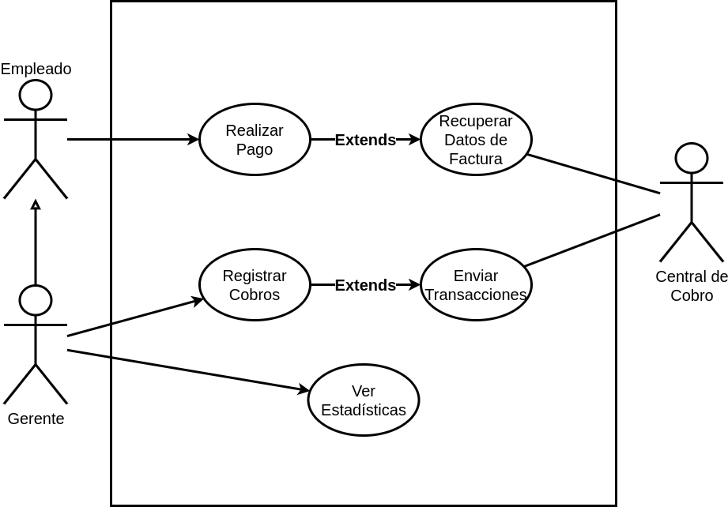

## Problema 08: Pago de Impuestos y Servicios.

**Actores:**

- Empleado

- Gerente

- Servidor de la Central de Cobro

**Casos de Usos**

- Realizar Pago.

- Recuperar Datos de Factura.

- Registrar Cobros.

- Enviar Transacciones.

- Ver Estadísticas.
___

#### Nombre del caso de uso:

- Realizar Pago.

**Descripción:** 

- Este Caso de Uso describe el evento en el que el Empleado o Gerente hace el cobro de una factura.

**Actores:** 

- Empleado.

**Precondiciones:**

- 

**Curso Normal:**

- **Acción del Actor:**

	- Paso 1: El Empleado o Gerente selecciona la opción de "Cobrar"
	
	- Paso 3: el Empleado ingresa el código

- **Acciones del Sistema:**

	- Paso 2: el sistema solicita el código de pago electrónico
	
	- Paso 4: el sistema ejecuta el CU "Recuperar Datos de Factura"
	
	- Paso 5: el sistema verifica la fecha de vencimiento
	
	- Paso 6: el sistema calcula el monto a cobrar según el vencimiento
	
	- Paso 7: el sistema cobra el monto solicitado

**Curso Alterno:**

- Paso alternativo 4: Error al recuperar los datos de la factura. Se informa y finaliza el CU.

- Paso alternativo 6: No hay monto a cobrar por fecha de 2do vencimiento. Se notifica y finalica el CU.

**Postcondición:**

- 

___

#### Nombre del caso de uso:

- Recuperar Datos.

**Descripción:** 

- Este Caso de Uso describe el evento en el que se recuperan los datos de una factura de la Central de Cobros.

**Actores:** 

- Servidor de la Central de Cobro.

**Precondiciones:**

- Haber ejecutado el CU "Realizar Pago".

**Curso Normal:**

- **Acción del Actor:**

	- Paso 2: el Servidor Externo acepta la conexión y solicita	el token
	
	- Paso 4: el Servidor verifica el token y retorna el resultado
	
	- Paso 6: el Servidor acepta la solicitud y colicita los datos de la factura
	
	- Paso 8: el Servidor verifica los datos de la factura y retorna el resultado

- **Acciones del Sistema:**

	- Paso 1: el sistema establece conexión con el Servidor Externo
	
	- Paso 3: el sistema envía el token al Servidor Externo
	
	- Paso 5: el sistema recibe el estado del token y solicita el envío de los datos de la factura
	
	- Paso 7: el sistema envía los datos de la factura
	
	- Paso 9: el sistema recibe los datos y finaliza la conexión con el Servidor de la Central de Cobros.

**Curso Alterno:**

- Paso alternativo 1: No hay conexión con el Servidor. Se informa y finaliza el CU.

- Paso alternativo 5: El token es incorrecto, se informa y finaliza el CU.

**Postcondición:**

- Se recuperan los datos de una factura.

___

#### Nombre del caso de uso:

- Registrar Cobros

**Descripción:**

- Este Caso de Uso describe el evento en el que el Gerente de la surcursal regristra los cobros del día.

**Actores:** 

- Gerente

**Precondiciones:**

- 

**Curso Normal:**

- **Acción del Actor:**

	- Paso 1: El Gerente selecciona la opción de "Registrar Cobros"
	
	- Paso 3: el Gerente ingresa la clave maestra

- **Acciones del Sistema:**

	- Paso 2: el sistema solicita la clave maestra.
	
	- Paso 4: el sistema verifica la clave ingresada
	
	- Paso 5: el sistema recupera las transacciones del día
	
	- Paso 6: el sistema ejecuta el CU "Enviar Transacciones"
	
	- Paso 7: el sistema registra como enviadas las transacciones del día

**Curso Alterno:**

- Paso alternativo 4: la clave maestra es incorrecta. Se notifica y finaliza el CU.

- Paso alternativo 6: No se pueden enviar las transacciones del día, se informa y finaliza el CU.

**Postcondición:**

- Se registran los pagos y transacciones.

___

#### Nombre del caso de uso:

- Enviar Transacciones.

**Descripción:** 

- Este CU describe el evento en el que La Central de Cobros recibe las transacciones del día.

**Actores:** 

- Central de Cobros.

**Precondiciones:**

- Haber ejecutado el CU "Registrar Cobros".

**Curso Normal:**

- **Acción del Actor:**

	- Paso 2: La Central de Cobro acepta la conexión y solicita le token
	
	- Paso 4: la Central verifica el token recibido y retorna el resultado
	
	- Paso 7: la Central recibe las transacciones y confirma la recepción

- **Acciones del Sistema:**

	- Paso 1: El sistema establece conexión con la Central de Cobro
	
	- Paso 3: el sistema envía el token
	
	- Paso 5: el sistema recibe que el token es correcto
	
	- Paso 6: el sistema envía las transacciones del día
	
	- Paso 8: el sistema recibe la confirmación de la recepción de las transacciones y finaliza la coneción con la Central de Cobro.

**Curso Alterno:**

- Paso alternativo 1: No hay conexión con la Central de cobro, se informa y finaliza el CU.

- Paso alternativo 5: El token se enceuntra vencido. Se informa y finaliza el CU.

- Paso alternativo 8: Se recibe el rechazo de la recepción de las transacciones del día porque ya ha sido efectuado. Se notifica y fin de CU.

**Postcondición:**

- Se registran las transacciones en la Central de Cobros. 

___

#### Nombre del caso de uso:

- Ver Estadísticas.

**Descripción:** 

- Este Caso de Uso describe el evento en el que el Gerente visualiza los impuestos y servicios cobrados.

**Actores:**

- Gerente

**Precondiciones:**

- 

**Curso Normal:**

- **Acción del Actor:**

	- Paso 1: El Gerente selecciona la opción de "Visualizar Estadísticas"
	
	- Paso 3: el Gerente ingresa la clave maestra
	
	- Paso 6: el Gerente ingresa las fechas

- **Acciones del Sistema:**

	- Paso 2: el sistema solicita la clave maestra
	
	- Paso 4: el sistema verifica la clave maestra
	
	- Paso 5: el sistema solicita el rango de fechas
	
	- Paso 7: el sistema valida el rango de fechas ingresado
	
	- Paso 8: el sistema informa los montos y la cantidad de cobros realizados agrupando por empresa.

**Curso Alterno:**

- Paso alternativo 4: La clave maestra ingresada es incorrecta, se informa y finaliza el CU.

- Paso alternativo 7: No hay cobros realizados en esas fechas, se informa y finaliza el CU.

**Postcondición:**

- Se visualizan los cobros realizados en el rango de fechas indicados.

___

**Nombre del caso de uso:**

- 

**Descripción:** 

**Actores:** 

**Precondiciones:**

**Curso Normal:**

- **Acción del Actor:**

	-
	
	-

- **Acciones del Sistema:**

	-
	
	-

**Curso Alterno:**

**Postcondición:**

___

