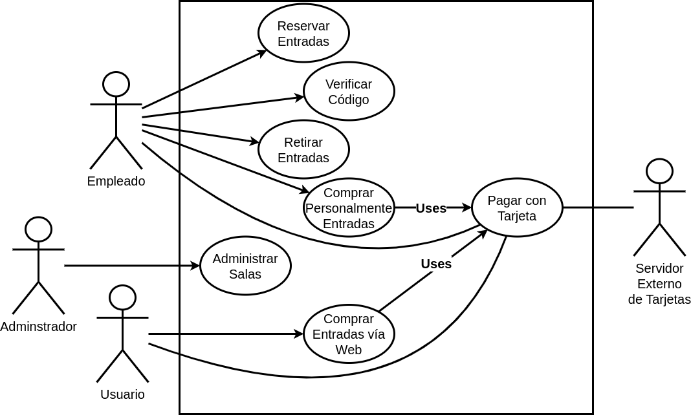

## Problema 09: Un Aventón.

Se desea desarrollar un sistema que permita compartir un vehículo para un viaje. La idea es que cuando una persona tiene que realizar un viaje lo publique en la aplicación. Luego, el resto de los usuarios se postulan para acompañarla y el chofer podrá seleccionar quienes viajan. El objetivo es abaratar costos y evitar congestiones en el tránsito. El sistema es gratuito.

Para utilizar el sistema, una persona debe registrarse y estar correctamente identificado antes de poderutilizarlo. Al registrarse, se pide un nombre de usuario, un correo electrónico y una contraseña. No puede haber dos correos electrónicos iguales en el sistema. Una vez autenticado, podrá dar de alta diferentes viajes, identificando la fecha, hora y el automóvil que utilizará. Los diferentes viajes que una persona publique no pueden superponerse. Un usuario que adeuda calificaciones tampoco podrá publicar un viaje. 

Cualquier usuario identificado podrá postularse a un viaje. Luego, el usuario dueño del viaje podrá aceptar o rechazar los candidatos para que realicen el viaje con él. En el sistema existe una política de reputaciones que permiten a los usuarios conocer la opinión del resto sobre los viajes realizados. Luego de terminado un viaje, tanto el piloto como los copilotos que viajaron deberán calificarse entre sí. El piloto califica a todos sus copilotos. Cada copiloto califica al piloto del viaje. 

Las calificaciones podrán ser positivas (suma un punto de reputación) o negativas (restan un punto de reputación).

**Actores:**

- Persona
- Usuario (piloto/copiloto)

**Casos de Usos**

- Iniciar Sesión.

- Cerrar Sesión.

- Registrar Persona.

- Publicar Viaje.

- Postular a un viaje.

- Seleccionar Candidatos.

- Calificar Usuario.

___

**Nombre del caso de uso:**

- Iniciar Sesión

**Descripción:** 

**Actores:** 

**Precondiciones:**

**Curso Normal:**

- **Acción del Actor:**

	-
	
	-

- **Acciones del Sistema:**

	-
	
	-

**Curso Alterno:**

**Postcondición:**

___

**Nombre del caso de uso:**

- Cerrar Sesión

**Descripción:** 

**Actores:** 

**Precondiciones:**

**Curso Normal:**

- **Acción del Actor:**

	-
	
	-

- **Acciones del Sistema:**

	-
	
	-

**Curso Alterno:**

**Postcondición:**

___

**Nombre del caso de uso:**

- Registrar Persona

**Descripción:** 

**Actores:** 

**Precondiciones:**

**Curso Normal:**

- **Acción del Actor:**

	-
	
	-

- **Acciones del Sistema:**

	-
	
	-

**Curso Alterno:**

**Postcondición:**

___

**Nombre del caso de uso:**

- Publicar Viaje

**Descripción:** 

- Este Caso de Uso describe el evento en el que un Usuario publica un viaje.

**Actores:** 

- Usuario

**Precondiciones:**

- El Usuario debe tener la sesión iniciada

**Curso Normal:**

- **Acción del Actor:**

	- Paso 1: El Usuario selecciona la opción de "Publicar Viaje"
	
	- Paso 4: el usuario ingresa los datos del viaje

- **Acciones del Sistema:**
	
	- Paso 2: el sistema verifica que el Usuario no adeude calificaciones

	- Paso 3: el sistema solicita fecha, hora, y automovil que utilizará
	
	- Paso 5: el sistema verifica los datos del viaje
	
	- Paso 6: el sistema registra y publica el viaje.

**Curso Alterno:**

- Paso alternativo 2: El Usuario adeuda calificaciones. Se informa y finaliza el CU.
	
- Paso alternativo 5: Los datos del viaje se superponen con otro viaje del mismo usuario. Se notifica y termina el Caso de Uso.

**Postcondición:**

- Se publica un viaje.

___

**Nombre del caso de uso:**

- Postularse a un viaje

**Descripción:** 

- Este Caso de Uso describe el evento en el que un Usuario se postula a un viaje.

**Actores:**

- Usuario

**Precondiciones:**

- El Usuario debe tener la sesión iniciada.

**Curso Normal:**

- **Acción del Actor:**

	- Paso 1: El Usuario selecciona la opción de "Mostrar Viajes"
	
	- Paso 3: el usuario selecciona un viaje

- **Acciones del Sistema:**

	- Paso 2: el sistema lista los viajes disponibles
	
	- Paso 4: el sistema lo pone en la lista de esperera.

**Curso Alterno:**

- Paso alternativo 2: No hay viajes disponibles. Se notifica, fin de CU.

**Postcondición:**

- Un usuario es puesto en la lista de espera.

___

**Nombre del caso de uso:**

- Seleccionar Candidatos.

**Descripción:** 

- Este Caso de Uso describe el evento en el que un Usuario selecciona un candidato para el viaje.

**Actores:** 

- Usuario

**Precondiciones:**

**Curso Normal:**

- **Acción del Actor:**

	- Paso 1: El Usuario selecciona la opción de "Listar Candidatos"
	
	- Paso 3: el usuario "Selecciona" un pasajero
	

- **Acciones del Sistema:**

	- Paso 2: el sistema muestra una lista con los pasajeros postulados.
	
	- Paso 4: el sistema registra al pasajero en el viaje.
	

**Curso Alterno:**

- Paso alternativo 2: No hay usuarios postulados. Se notifica y termina el CU.

**Postcondición:**

- Se seleccionó un Usuario.

___

**Nombre del caso de uso:**

- Calificar Usuario.

**Descripción:** 

- Este Caso de Uso describe el evento en el que un Usuario califica a otro.

**Actores:** 

- Usuario

**Precondiciones:**

- El Usuario debe tener la sesión iniciada.

**Curso Normal:**

- **Acción del Actor:**

	- Paso 1: el Usuario selecciona la opción de "Calificar Usuarios"
	
	- Paso 3: el Usuario selecciona al Usuario a calificar
	
	- Paso 5: el Usuario califica positivamente

- **Acciones del Sistema:**
	
	- Paso 2: el sistema muestra los usuarios
	
	- Paso 4: el sistema solicita la calificación
	
	- Paso 6: el sistema registra la calificación del Usuario

**Curso Alterno:**

- Paso alternativo 2: no hay usuarios para calificar. Se notifica y termina el CU.

- Paso alternativo 5: el usuario califica negativamente.

**Postcondición:**

- Se hace la calificación del Usuario
