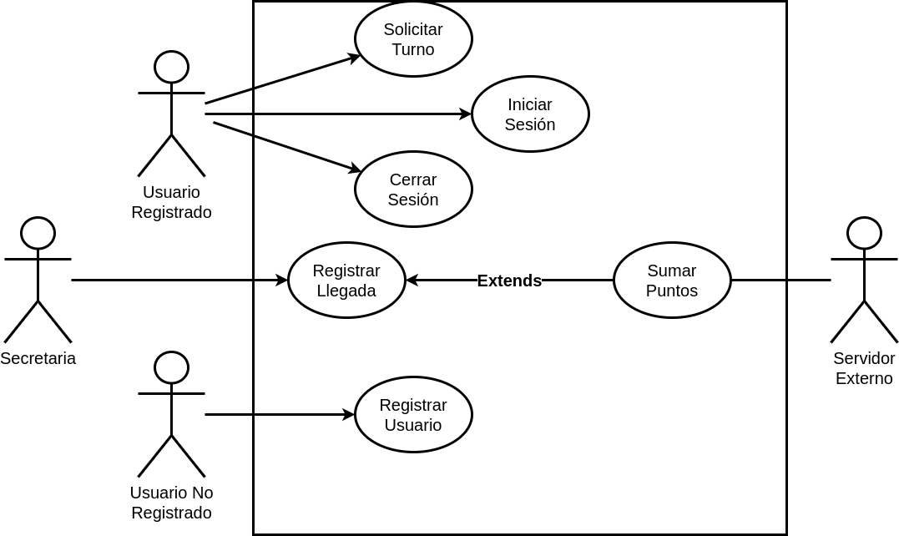

## Problema 10: Gimnasio.

**Actores:**

- Usuario no Registrado

- Usuario Registrado

- Secretaria

- Servidor Externo

**Casos de Usos**

- Registrar Usuario.

- Iniciar Sesión.

- Cerrar Sesión.

- Solicitar Turno.

- Registrar Llegada.

- Sumar Puntos

___

#### Nombre del caso de uso:

- Registrar Usuario.

**Descripción:** 

- Este Caso de Uso describe el evento en el que un Usuario no Registrado se registra en el sistema.

**Actores:** 

- Usuario no Registrado.

**Precondiciones:**

- 

**Curso Normal:**

- **Acción del Actor:**

	- Paso 1: el Usuario no Registrado selecciona la opción de "Registrarse"
	
	- Paso 3: el usuario ingresa los datos personales.
	
	- Paso 5: el usuario ingresa email.

- **Acciones del Sistema:**

	- Paso 2: el sistema solicita datos personales.
	
	- Paso 4: el sistema solicita email del registro
	
	- Paso 6: el sistema verifica que no exista otro email 
	
	- Paso 7: el sistema registra el Usuario y genera y envía la contraseña del mismo.

**Curso Alterno:**

- Paso alternativo 6: el email ingresado ya existe, se informa y se retorna al paso 4.

**Postcondición:**

___

#### Nombre del caso de uso:

- Iniciar Sesión

**Descripción:**

- Este Caso de Uso describe el evento en el que un Usuario Registrado inicia sesión con su email y contraseña en el sistema.

**Actores:** 

- Usuario Registrado

**Precondiciones:**

- 

**Curso Normal:**

- **Acción del Actor:**

	- Paso 1: el Usuario Registrado selecciona "Iniciar Sesión"
	
	- Paso 3: el usuario registrado ingresa el email y contraseña

- **Acciones del Sistema:**

	- Paso 2: el sistema solicita email y contraseña
	
	- Paso 4: el sistema verifica el email y contraseña
	
	- Paso 5: el sistema registra la sesión y habilita las funciones del usuario registrado

**Curso Alterno:**

 - Paso alternativo 4: el email ingresado es incorrecto. Se informa y finaliza el CU.
 
 - Paso alternativo 4: la contraseña ingresa es incorrecta. Se informa y finaliza el CU.

**Postcondición:**

- Se inicia la sesión y habilitan las funciones del Usuario Registrado.

___

#### Nombre del caso de uso:

- Cerrar Sesión

**Descripción:** 

**Actores:** 

- Usuario Registrado

**Precondiciones:**

- Tener sesión iniciada

**Curso Normal:**

- **Acción del Actor:**

	-
	
	-

- **Acciones del Sistema:**

	-
	
	-

**Curso Alterno:**

**Postcondición:**

___

#### Nombre del caso de uso:

- Solicitar Turno

**Descripción:** 

- Este Caso de Uso describe el evento en el que un Usuario Registrado solicita un turno.

**Actores:**

- Usuario Registrado

**Precondiciones:**

- El Usuario Registrado debe tener la sesión iniciada.

**Curso Normal:**

- **Acción del Actor:**

	- Paso 1: El Usuario Registrado selecciona la opción de "Solicitar Turno"
	
	- Paso 2: el usuario ingresa: fecha, hora y actividad

- **Acciones del Sistema:**

	- Paso 2: el sistema solicita los datos del Turno
	
	- Paso 3: el sistema verifica que haya un cupo disponible
	
	- Paso 4: el sistema registra el turno del Usuario

**Curso Alterno:**

- Paso alternativo 5: no hay cupos disponibles para esa actividad. Se informa y finaliza el CU.

**Postcondición:**

___

#### Nombre del caso de uso:

- Registrar Llegada.

**Descripción:**

- Este Caso de uso describe el evento en el que la Secretaria registra la asistencia del cliente.

**Actores:** 

- Secretaria

**Precondiciones:**

- 

**Curso Normal:**

- **Acción del Actor:**

	- Paso 1: La secretaria selecciona la opción de "Registrar Cliente"
	
	- Paso 3: la secretaria ingresa el dni del cliente

- **Acciones del Sistema:**

	- Paso 2: el sistema solicita el dni del cliente
	
	- Paso 4: el sistema verifica el dni del cliente
	
	- Paso 5: se ejecuta el Caso de Uso: "Sumar Puntos"
	
	- Paso 6: se registra la asistencia del cliente

**Curso Alterno:**

- Paso alternativo 4: el dni ingresado no figura en el sistema. Se notifica y termina el CU.

- Paso alternativo 5: no se pudo hacer la suma correspondiente de puntos. Se notifica y termina el CU.

**Postcondición:**

- Se registra la asistencia del cliente.

___

#### Nombre del caso de uso:

- Sumar puntos

**Descripción:** 

- Este Caso de Uso describe el evento en el que el Servidor Externo hace la suma correspondiente de puntos al cliente que registra su llegada.

**Actores:** 

- Servidor Externo

**Precondiciones:**

- Haber ejecutado el Caso de Uso: Registrar Llegada.

**Curso Normal:**

- **Acción del Actor:**

	- Paso 2: el Servidor Externo acepta la conexión
	
	- Paso 3: el Servidor Externo solicita los datos del cliente
	
	- Paso 5: el Servidor Externo hace la suma correspondiente de puntos
	
	- Paso 6: el Servidor Externo confirma la suma de puntos

- **Acciones del Sistema:**

	- Paso 1: el sistema establece conexión con el Servidor Externo
	
	- Paso 4: el sistema envía el dni del cliente y la actividad
	
	- Paso 7: el sistema recibe la confirmación y cierra la conexión con el Servidor Externo.

**Curso Alterno:**

- Paso alternativo 1: no se puede establecer conexión con el servidor externo. Se notifica y finaliza el CU.

- Paso alternativo 7: no se recibe la confirmación, se informa y finaliza el CU.

**Postcondición:**

- Se hace la suma correspondiente de puntos al cliente.

