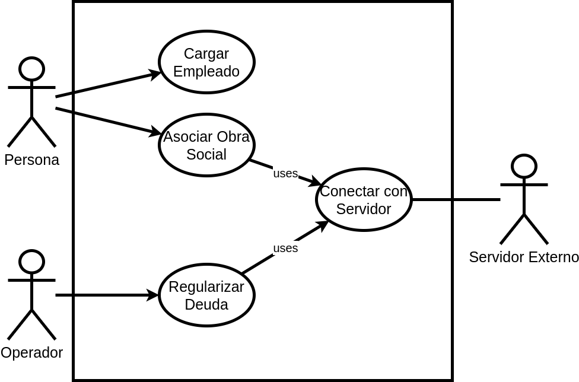

### Problema 11: Carga de Impuestos.

**Actores:**

- Secretaria
- Servidor Externo
- Empleado

**Casos de Usos**

- Cargar Empleado.
- Asociar Obra Social.
- Conectar con Servidor.
- Regularizar Deuda.

___

#### Nombre del caso de uso:

- Cargar Empleado.

**Descripción:** 

- Este Caso de Uso describe el evento en el que una secretaria registra un empleado en el sistema.

**Actores:**

- Secretaria

**Precondiciones:**

- 

**Curso Normal:**

- **Acción del Actor:**

	- Paso 1: El/La secretaria ingresa la opción de "Cargar Empleado"
	
	- Paso 3: la secretaria ingresa los datos: apellido, nombre, edad y domicilio
	
	- Paso 5: la secretaria ingresa el dni

- **Acciones del Sistema:**

	- Paso 2: el sistema solicita los datos del empleado
	
	- Paso 4: el sistema solicita el dni del empleado
	
	- Paso 6: el sistema verifica que el agente no figure en la base de sumariados
	
	- Paso 7: el sistema registra el nuevo empleado.

**Curso Alterno:**

- Paso alternativo 6: el empleado ya se encuentra cargado en el sistema. Se notifica y finaliza el CU.

**Postcondición:**

- Se hace la carga de un nuevo empleado en el sistema.
___

#### Nombre del caso de uso:

- Asociar Obra Social.

**Descripción:** 

- Este Caso de Uso describe el evento en el que se consulta la morosidad de un empleado y se le asocia una obra social.

**Actores:** 

- Secretaria

**Precondiciones:**

**Curso Normal:**

- **Acción del Actor:**

	- Paso 1: La secretaria selecciona la opción de "Consultar Morosidad"
	
	- Paso 3: la secretaria ingresa el dni del empleado

- **Acciones del Sistema:**

	- Paso 2: el sistema solicita el dni del empleado
	
	- Paso 4: el sistema verifica el dni del empleado
	
	- Paso 5: el sistema ejecuta el CU: Conectar con servidor
	
	- Paso 6: el sistema informa que el agente no es moroso, se le asocia la obra social e imprime el carnet

**Curso Alterno:**

- Paso alternativo 5: no hay conexión con el servidor. Se informa y finaliza el CU

- Paso alternativo 6: el sistema informa que el agente es moroso y se imprime un código de inicio de trámite para regularizar su situación.

**Postcondición:**

- Se le asocia una obra social al empleado.

___

#### Nombre del caso de uso:

- Conectar con servidor.

**Descripción:** 

- Este Caso de Uso describe el evento en el que se hace la conexión a una base de datos externa y se analiza la morosidad de un empleado.

**Actores:** 

- Servidor externo

**Precondiciones:**

- Haber ejecutado el CU: Consultar Morosidad.

**Curso Normal:**

- **Acción del Actor:**

	- Paso 2: el servidor acepta la conexión
	
	- Paso 3: el servidor solicita el dni del empleado
	
	- Paso 5: el servidor verifica la morosidad del empleado
	
	- Paso 6: el servidor retorna el resultado

- **Acciones del Sistema:**

	- Paso 1: el sistema solicita conexión con el Servidor externo
	
	- Paso 4: el sistema envía el dni del empleado
	
	- Paso 5: el sistema recibe el resultado y cierra la conexión con el servidor

**Curso Alterno:**

- Paso alternativo 1: no hay conexión con el servidor. Se informa y finaliza el CU.

**Postcondición:**

- Se retorna la morosidad de un empleado.

___

#### Nombre del caso de uso:

- Regilarizar Deuda.

**Descripción:** 

- Este Caso de Uso describe el evento en el que un Empleado regulariza su deuda de morosidad.

**Actores:** 

- Empleado

**Precondiciones:**

- 

**Curso Normal:**

- **Acción del Actor:**

	- Paso 1: El EMpleado ingresa su dni y código de inicio de trámite

- **Acciones del Sistema:**

	- Paso 2: el sistema verifica los datos ingresados
	
	- Paso 3: el sistema ejecuta el CU: Conectar con Servidor
	
	- Paso 4: el sistema informa que deja de ser moroso, le asigna una obra social e imprime un carnet.

**Curso Alterno:**

- Paso alternativo 2: el dni ingresado no pertenece a un empleado. Se notifica y finaliza el CU.

- Paso alternativo 2: el código de trámite no existe. Se informa y finaliza el CU.

- Paso alternativo 3: no hay conexión con el Servidor. Se notifica y finaliza el CU.

- Paso alternativo 4: el sistema informa que sigue siendo moroso. Se notifica y finaliza el CU.

**Postcondición:**

- Se regulariza la deuda de un empleado.
