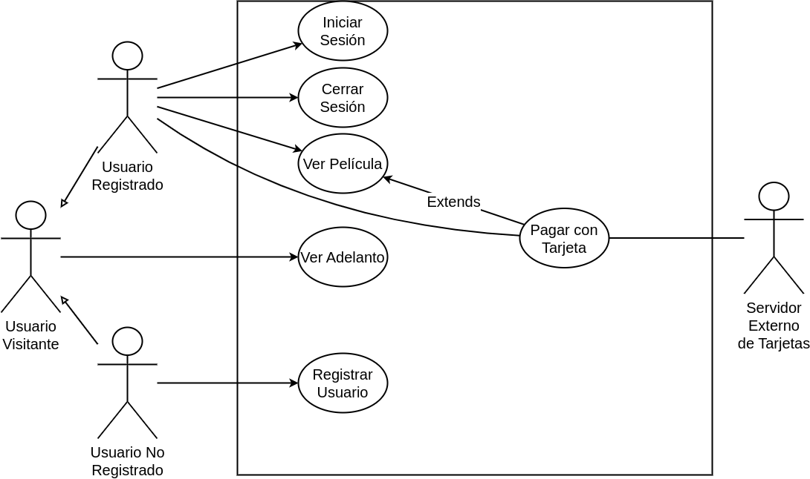

<h2 align="center">Práctica 3 – Casos de Uso</h1>

### Parte 1: Definiciones Generales

#### a) Describa qué es el desarrollo centrado en el usuario.

- Proceso de desarrollo de sistemas basado en la comprensión de las necesidades de los involucrados y las razones por las que deben desarrollarse los sistemas.

#### b) Defina qué son los casos de uso y describa cómo se utilizan.

- Los casos de usos describen las funciones del sistema desde la perspectiva de los usuarios externos de una forma y con una terminología que ellos entienden. El alcanzar exacta y minuciosamente esto requiere un alto nivel de participación por parte del usuario.
- Se definen durante la etapa de los requerimientos del ciclo de vida y se refinirán adicionalmente a lo largo del ciclo de vida.

#### c) Defina qué es un actor y un escenario.

- **Actor:** Cualquier cosa que necesite interactuar con el sistema para intercambiar información.
	- No significa que retrate a una persona o puesto de trabajo. 
	- Puede ser una organización, otro sistema de información, un dispositivo externo tal como un sensor de calor.

- **Escenario:** Descripción detallada de cada caso de uso para llevar a cabo la funcionalidad.
	

#### d) Defina las relaciones que pueden presentarse en el diagrama de casos de uso. Describa cuándo se utiliza cada una.

- **Asociaciones:** Relación entre un actor y un CU en el que interactúan entre sí.

- **Extensión:** 
	- Un CU extiende la funcionalidad de otro CU. 
	- Un CU puede tener muchos CU extensiones. 
	- Los CU extensiones sólo son iniciados por un CU.
	
- **Uso o Inclusión (Uses):** Reduce la redundancia entre dos o más CU al combinar los pasos comunes de los CU.

- **Dependencia (Depends):** Relación entre CU que indica que un CU no puede realizarse hasta que se haya realizado otro CU.

- **Herencia:** Relación entre actores donde un actor hereda las funcionalidades de uno o varios actores. 

#### e) Enumere los beneficios de modelar requerimientos del sistema con casos de uso.

- Herramienta para capturar requerimientos funcionales.
- Descompone el alcance del sistema en piezas más manejables.
- Medio de comunicación con los usuarios.
- Utiliza lenguaje común y fácil de entender por las partes.
- Permite estimar el alcance del proyecto y el esfuerzo a realizar.
- Define una línea base para la definición de los planes de prueba.
- Define una línea base para toda la documentación del sistema.
- Proporciona una herramienta para el seguimiento de los requisitos.

### Ejemplo
Un sitio web dispone de películas que se publican de manera semanal. Se desea
desarrollar un subsistema para la reproducción de estas películas.

La información puede ser accedida tanto por usuarios registrados o usuarios
visitantes. A los usuarios registrados se les permite ver adelantos (trailers) y ver las películas completas. Para esto último, los usuarios deben estar correctamente autenticados. Además, si la película tiene categoría “exclusiva”
la visualización tendrá un costo. El pago es mediante tarjeta de crédito a través de un servidor al que se le envía el número de la tarjeta y el código de
seguridad. Una vez validados estos datos y comprobados los fondos el servidor
realiza el cobro.

A los usuarios visitantes sólo se les permite ver los adelantos. Para esto, el
sistema muestra una lista de las últimas películas de la semana. El usuario
selecciona cuál desea ver, y el sistema lo reproduce en pantalla.

Un usuario visitante puede registrarse y pasar a ser un usuario registrado, para lo cual debe completar los datos personales, eligiendo un nombre de usuario único y una contraseña.

#### Nombre del caso de uso:

- Ver Película.

**Descripción:** 

- Este Caso de Uso describe el evento en el que un Usuario Registrado visualiza una película.

**Actores:** 

- Usuario Registrado.

**Precondiciones:**

- El Usuario Registrado debe tener la sesión iniciada.

**Curso Normal:**

- **Acción del Actor:**

	- Paso 1: El Usuario Registrado selecciona la opción de "Ver película"
	
	- Paso 3: el Usuario Registrado selecciona la película

- **Acciones del Sistema:**

	- Paso 2: el sistema lista las películas disponibles y la opción de "Cancelar"
	
	- Paso 4: el sistema verifica el tipo de película
		- Paso 4.1: la película es del tipo exclusica, ejecuta el caso de uso pagar con tarjeta
		
	- Paso 5: el sistema reproduce la película seleccionada

**Curso Alterno:**

- Paso alternativo 4.1: El pago no se realiza. Se notifica al usuario y finaliza el CU.

**Postcondición:**

- Se reproduce una película

___

#### Nombre del caso de uso:**

- Ver Adelanto

**Descripción:**

- Este Caso de Uso describe el evento en el que un Usuario Visitante reproduce el trailer de una película.

**Actores:**

- Usuario Visitante

**Precondiciones:**

- 

**Curso Normal:**

- **Acción del Actor:**

	- Paso 1: el Usuario Visitante selecciona la opción de "Visualizar Adelanto"
	
	- Paso 3: el Usuario Visitante selecciona el adelante que desea ver

- **Acciones del Sistema:**

	- Paso 2: el sistema muestra el listado de adelantos disponibles y la opción de "Cancelar" si no se encuentra el adelanto que se desea visualizar
	
	- Paso 4: el sistema reproduce el adelanto de la película seleccionado.

**Curso Alterno:**

- Paso alternativo 3: se seleccionó la cancelación de la operación. Se notifica y finaliza el CU.

**Postcondición:**

- Se reproduce el adelanto de una película.

___

#### Nombre del caso de uso:

- Pagar con Tarjeta

**Descripción:** 

- Este Caso de Uso describe el cobro de una película mediante una tarjeta.

**Actores:** 

- Servidor Externo.
- Usuario Registrado.

**Precondiciones:**

- Haber ejecutado el CU "Ver película"

**Curso Normal:**

- **Acción del Actor:**

	- Paso 2: el Usuario Registrado ingresa los datos de la tarjeta
	
	- Paso 4: el Servidor Externo acepta la conexión y solicita los datos de la tarjeta
	
	- Paso 6: el Servidor Externo valida los datos de la tarjeta y verifica que la tarjeta posea fondos suficientes.
	
	- Paso 7: el Servidor Externo retorna el resultado

- **Acciones del Sistema:**

	- Paso 1: El sistema solicita los datos de la tarjeta
	
	- Paso 3: el sistema establece conexión con el Servidor Externo
	
	- Paso 5: el sistema envía los datos de la tarjeta al Servidor Externo
	
	- Paso 8: el sistema recibe que los datos de la tarjeta son correctos
	
	- Paso 9: el sistema recibe que la tarjeta posee fondos suficientes
	
	- Paso 10: el sistema registra el pago y cierra la conexión con el Servidor Externo.
	

**Curso Alterno:**

- Paso alternativo 3: No hay conexión con el servidor externo. Se informa y finaliza el CU.
- Paso alternativo 8: Los datos de la tarjeta son incorrectos. Se notifica y finaliza el CU.
- Paso alternativo 9: La tarjeta no posee fondos suficientes. Se informa y finaliza el CU

**Postcondición:**

- Se efectúa y registra el pago a través de la tarjeta.

___

#### Nombre del caso de uso:

- Registrar Usuario

**Descripción:**

- Este Caso de Uso describe el evento en el que un Usuario no Registrado, ingresa sus datos para realizar el registro en el sistema.

**Actores:**

- Usuario no Registrado

**Precondiciones:**

- 

**Curso Normal:**

- **Acción del Actor:**

	- Paso 1: El Usuario no Registrado selecciona la opción de "Registrar"
	
	- Paso 3: el Usuario no Registrado ingresa sus datos personales
	
	- Paso 5: el Usuario no Registrado ingresa nombre de usuario y contraseña

- **Acciones del Sistema:**

	- Paso 2: el sistema solicita los datos personales del Usuario no Registrado.
	
	- Paso 4: el sistema solicita nombre de usuario único y contraseña
	
	- Paso 6: el sistema verifica que el nombre de usuario ingresado no exista en el sistema
	
	- Paso 7: el sistema registra al nuevo usuario

**Curso Alterno:**

- Paso alternativo 6: el usuario ingresado ya existe en el sistema. Se informa y retorna al paso 4.

**Postcondición:**

- Se crea una nueva cuenta de usuario

___

#### Nombre del caso de uso:

- Iniciar Sesión

**Descripción:** 

- Este Caso de Uso describe el evento en el que un Usuario Registrado inicia sesión con su nombre de usuario y contraseña.

**Actores:** 

- Usuario Registrado

**Precondiciones:**

- 

**Curso Normal:**

- **Acción del Actor:**

	- Paso 1: El Usuario Registrado selecciona la opción de "Iniciar Sesión"
	
	- Paso 3: El Usuario Registrado ingresa nombre de usuario y contraseña.

- **Acciones del Sistema:**

	- Paso 2: El sistema solicita usuario y contraseña.
	
	- Paso 4: el sistema verifica los datos de inicio de sesión.
	
	- Paso 5: el sistema registra el inicio de sesión y habilita las funciones del usuario registrado.

**Curso Alterno:**

	- Paso alternativo 4: el usuario o contraseña ingresados no son válidos. Se notifica y retorna al paso 2.

**Postcondición:**

- Se inicia la sesión del Usuario Registrado y habilitan las funciones del mismo.

___

#### Nombre del caso de uso:

- Cerrar Sesión.

**Descripción:** 

- Este Caso de Uso describe el evento en el que un Usuario Registrado cierra su sesión.

**Actores:** 

- Usuario Registrado.

**Precondiciones:**

- El usuario debe tener la sesión iniciada.

**Curso Normal:**

- **Acción del Actor:**

	- Paso 1: El Usuario Registrado selecciona la opción de "Cerrar Sesión"
	
	- Paso 3: el Usuario Registrado confirma la operación

- **Acciones del Sistema:**

	- Paso 2: el sistema solicita la confirmación del cierre de sesión
	
	- Paso 4: el sistema cierra la sesión y deshabilita las funciones del Usuario Registrado

**Curso Alterno:**

- Paso alternativo 3: el usuario cancela la operación. Fin de Caso de Uso

**Postcondición:**

- Se cierra la sesión y deshabilitan las funciones del Usuario Registrado.

