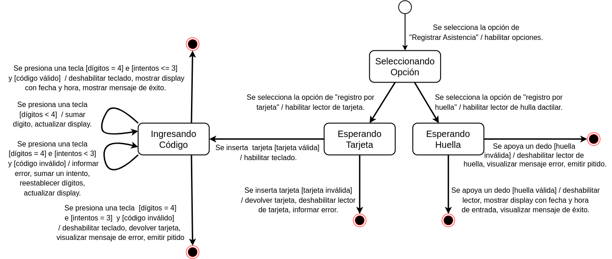
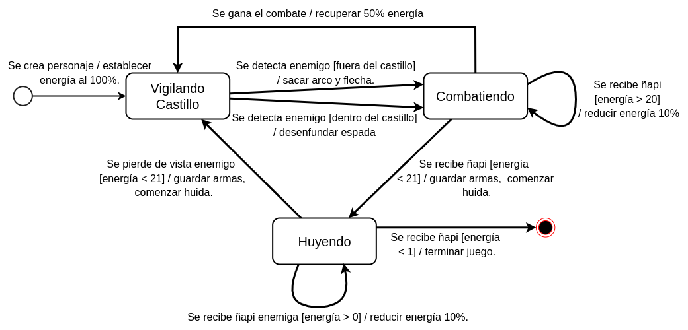
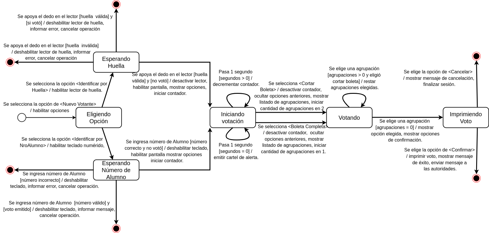
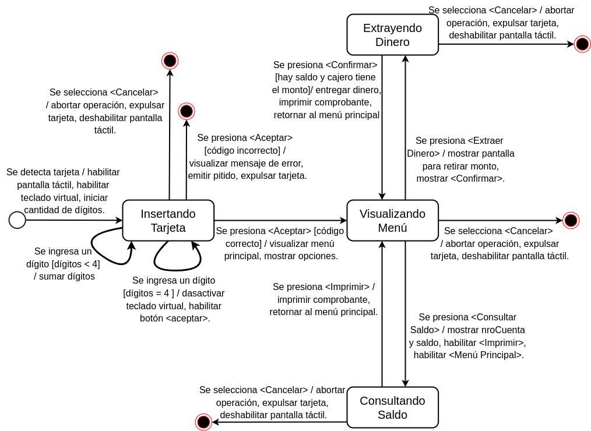

## Ejercicio 4: Realizar el DTE para modelar un turbo ventilador.
Considere un sistema de control de un turbo ventilador que posee tres niveles de velocidad. Para ir de un
nivel a otro, ya sea anterior o posterior, se debe girar una perilla en forma secuencial. Inicialmente el
ventilador se encuentra apagado. Girando la perilla en el sentido de las agujas del reloj se enciende y se
aumenta la velocidad, mientras que girando la perilla en el sentido contrario se disminuye. El ventilador
puede ser apagado girando hacia la izquierda en el nivel 1 o hacia la derecha en el nivel 3.

## Ejercicio 5: Modelar mediante un DTE el ingreso del personal a una empresa.
Para ello existe una máquina en donde un empleado debe registrar el presente. Para iniciar el registro se selecciona la opción “Registrar Asistencia”. Luego, se habilitan dos opciones posibles para registrar su presente: mediante su tarjeta o su huella dactilar.

Si el empleado selecciona “registro por tarjeta”, debe pasar la tarjeta por un lector. Si la tarjeta es válida se habilita un teclado virtual donde debe proceder a ingresar un código de 4 dígitos, en el caso de que la tarjeta fuese inválida se informa el error. Para el ingreso de los 4 dígitos se tienen sólo 3 intentos, pasados los 3 intentos se anula la operación y se retorna la tarjeta.

Si opta por registrar el presente mediante la huella dactilar sólo debe apoyar el dedo en el scanner.

En cualquiera de los 2 casos si el ingreso es exitoso se muestra en el display la fecha y el horario de entrada y un mensaje de éxito, caso contrario, se visualiza un mensaje de error y se emite un pitido.

## Ejercicio 6: Se desea modelar el funcionamiento de un personaje para un juego electrónico.
El personaje es un guardia medieval de un castillo. Su objetivo es vigilar el castillo y eliminar enemigos que puedan aparecer.

El personaje comienza su ronda de vigilancia cuando es creado por el sistema, con el 100% de energía. El modo normal del personaje es vigilar el castillo, mientras no detecte un enemigo. Al detectar uno, el personaje pasa a modo combate. Si el enemigo está fuera del castillo, el personaje saca su arco y flecha. Si el enemigo está dentro del castillo, el personaje saca su espada. Durante el combate, el personaje puede recibir “golpes”, reduciendo su energía 10% por cada uno. Si el personaje gana el combate, recupera el 50% de energía y vuelve con su ronda de vigilancia. Pero si pierde energía hasta quedarse con el 20%, entonces el personaje comienza a huir del enemigo, guardando su arma. Durante la huida el personaje puede seguir recibiendo “golpes”, hasta quedarse sin energía y morir, quedando fuera del juego. Cuando pierde de vista al enemigo, el personaje deja de huir y vuelve con su ronda de vigilancia, ganando un 30% de energía. 

## Ejercicio 7: Modelar mediante un DTE el sistema de voto electrónico para la facultad de informática.
El sistema cuenta con 2 terminales: la mesa de autoridades y la urna electrónica. 

Cuando un alumno se presenta a votar, le entrega la documentación a la autoridad de la mesa y el encargado del manejo del sistema selecciona la opción ‘Nuevo Votante’. No todos los alumnos tienen su huella dactilar registrada por lo que el sistema presenta 2 opciones: identificación por huella e identificación por número de alumno.

En el caso de que se seleccione la opción identificación por huella se procede a la lectura de la huella del alumno. Si la huella no es identificada por el sistema se cancela la operación. Si la huella es detectada correctamente y el alumno no votó se habilita la urna electrónica que es donde el alumno emite su voto.

En el caso de que se seleccione identificación por número de alumno, el sistema solicita que se ingrese el legajo y luego se continúa con el mismo procedimiento de emisión de voto. Si el legajo no es reconocido por el sistema es informado y se cancela la operación. Para ambos casos, una vez identificado el alumno, si el mismo ya emitió su voto el sistema muestra un mensaje y cancela la operación.

Una vez iniciada la votación, se habilita la pantalla y se muestran las opciones para elegir el tipo de votación: “boleta completa” o “cortar boleta”. Si pasan 30 segundos y el votante no ha decidido su tipo de votación, la maquina emitirá un cartel de alerta donde indica que debe realizar la elección correspondiente, el cartel se mantendrá en pantalla hasta que el votante decida su tipo de votación.
Una vez elegido el tipo de votación, se pasará a elegir la agrupación a votar, para ello la máquina oculta las opciones anteriores y muestra un listado de los partidos disponibles. Si se eligió cortar boleta, el votante deberá elegir dos agrupaciones, caso contrario, elige solo una agrupación.

Una vez emitido el voto, es decir, que seleccionó la/s agrupación/es correspondiente/s, se oculta el listado, se muestra en toda la pantalla la opción/es elegida/s, se muestra un botón para confirmar y se muestra otro botón para cancelar. Si confirma el voto, el mismo se envía a imprimir, se muestra un mensaje éxito, envía un mensaje a la mesa de autoridades y finaliza la sesión. Si cancela se muestra un mensaje de cancelación y finaliza la sesión.

## Ejercicio 8. Modelar mediante DTE la búsqueda de un destino para navegación por GPS.
Al seleccionar la opción “ir a destino” el sistema visualiza la “pantalla inicial de búsqueda” con las opciones: “últimos encontrados” y “nuevo destino”.

Si el usuario selecciona “últimos encontrados” se muestra una lista con los últimos 5 lugares buscados. Luego, el usuario debe seleccionar un lugar de dicha lista para iniciar la navegación.

Si el usuario selecciona “nuevo destino” el sistema visualiza un campo para completar la calle del destino, compuesta por caracteres alfanuméricos, y un botón “siguiente”. Una vez completo el ingreso de la calle y presionado “siguiente” el sistema muestra el campo altura, compuesto por caracteres numéricos, y un botón “confirmar”. Al confirmar el GPS busca la dirección ingresada, si se encuentra dicha dirección se inicia la navegación. Si la dirección no es encontrada por el sistema se informa el error y se retorna a la pantalla de búsqueda.

Para ambos casos, se muestra el mapa de ruta correspondiente y las opciones “Ir” y “Cancelar”. Si se selecciona “Ir”, el GPS comienza con la navegación. Si el usuario cancela se retorna a la “pantalla inicial de búsqueda”. Cuando GPS se encuentra navegando y pierde la señal de satélite entonces se queda a la espera de recepción de señal, cuando logra restablecer la señal continúa con la navegación. Si luego de 3 minutos no logra encontrar señal se cancela automáticamente la navegación y se retorna a la pantalla de búsqueda.

Mientras se está navegando el sistema actualiza una vez por segundo la ubicación geográfica, la información de la velocidad, distancia y tiempo restante.

Cuando termina la navegación el sistema retorna un mensaje de destino alcanzado.

El usuario puede detener la navegación en cualquier momento presionando el botón “detener navegación”, en cuyo caso, el sistema, retorna a la pantalla de inicio con la opción “Ir a destino”.

## Ejercicio 9. Modelar mediante un DTE el funcionamiento de un cajero automático.
El cajero posee una pantalla táctil, una ranura para la tarjeta, una ranura para expulsar el dinero y una para expulsar los comprobantes. Cuando el cajero detecta una tarjeta se habilita una pantalla en la cual espera el ingreso de la clave de 4 dígitos numéricos (a través de un teclado virtual). Una vez que se ingresan los 4 dígitos el cajero espera que se presione el botón aceptar. Si la clave es correcta, se visualiza el menú principal con dos operaciones posibles: extracción de dinero y consulta de saldo. Si la clave es incorrecta se visualiza un mensaje de error, emite un pitido y expulsa la tarjeta.

Si se selecciona la operación de extraer dinero, se muestra la pantalla para ingresar el monto a retirar y el botón confirmar. Si la cuenta posee saldo suficiente y el cajero contiene dicho monto, se entrega el dinero, se imprime el comprobante correspondiente y se retorna automáticamente al menú principal. En caso de que la cuenta no posea saldo suficiente se muestra un mensaje “Saldo insuficiente” y retorna al menú principal. En caso de que el cajero no contenga dicho monto se muestra un mensaje de “No se puede entregar el dinero” y retorna al menú principal

Si se selecciona la operación consulta de saldo, automáticamente se visualizan en pantalla el número de cuenta y su saldo, y se habilita un botón imprimir y un botón para volver al menú principal. Si se presiona imprimir, se imprime el comprobante con los datos de la cuenta y retorna automáticamente al menú principal.

En cualquier momento, se puede seleccionar la opción Cancelar que aborta la operación actual y expulsa la tarjeta, saliendo del sistema.

## Ejercicio 10. Modelar un sistema para una cinta para correr.
La cinta consta de un display táctil y un botón de encendido/apagado.

Cuando se presiona encender, la cinta inicia en un estado de reposo, se habilita el display, se muestra un mensaje de bienvenida, la velocidad de la misma (inicialmente en cero), las opciones “+” y “-“, para aumentar y disminuir dicha velocidad y tres programas predefinidos de entrenamiento (inicial, intermedio y máximo).

Una vez encendida la cinta, el usuario debe elegir uno de estos tres programas para comenzar a entrenar. Estando en cualquiera de los tres programas, el usuario, puede cambiar a algún otro programa de entrenamiento, o finalizar el mismo mediante un botón de “fin de programa” volviendo al estado de reposo. Además, puede variar la velocidad del mismo, sin salir del programa en el que se encuentra. La velocidad oscila en un rango de 0 a 9, y aumenta y disminuye en escala de 1. Si la velocidad disminuye a cero, la cinta vuelve al estado de reposo.

En cualquier momento se puede apagar la cinta.

