<h1 align="center">Práctica 5 - Redes de Petri</h1>

<h2>Parte 1: Teoría.</h2>

**a)** Describa qué tipos de problemas se pueden modelar utilizando Redes de Petri.

- Utilizadas para especificar problemas en tiempo real en los que son necesarios representar aspectos de concurrencia.
- Permiten modelar sistemas dinámicos y concurrentes mediante una representación gráfica de eventos discretos.

**b)** Enumere y explique elementos, vistos en teoría, que se utilizan para modelar las Redes de Petri.

1. **Sitio/Lugar**: Modela un estado o una condición.
	
2. **Transiciones**: Modela un evento o una acción.

3. **Arco**: Relaciona un sitio con una transición o una transición con un sitio.

**c)** Explique que son las marcas o tokens.

-  **Marca(token)**: Representan la presencia de recursos, información o la activación de un avento en un lugar específico. Su función es habilitar/deshabilitar transiciones para controlar la ejecución de la red. Se colocan en los sitios. Puede haber más de uno en un sitio.

**d)** Explique qué significa una transición que tiene salidas pero no entradas.

- Significa que la transición no tiene condiciones de disparos basadas en la presencia de tokens en lugares de entrada. 
- La transición se puede disparar en cualquier momento sin depender de las condiciones de otros lugares.
- Son útiles cuando se quiere modelar un proceso que se activa de manera independiente de otras actividades del sistema

**e)** Explique qué significa una transición que tiene entradas pero no salidas.

- Significa que la transición puede tener condiciones de disparo basadas en la presencia de tokens en lugares de entrada, pero una vez que se dispara, no produce ningún token en lugares de salida.

<h2 align="start">Parte 2: Práctica.</h2>

### Ejercicio 1: Fábrica de papas.
Se desea modelar con Redes de Petri el funcionamiento de una fábrica de papas bastón crudas.

Las papas llegan de a una y se depositan en un contenedor común. El primer paso es pasar la papa por una máquina que quita la cáscara. Esta máquina solo puede atender de a una papa a la vez. Las papas peladas son depositadas en un contenedor común a la espera de la próxima etapa. La cáscara por su parte, es depositada en un basurero general.

Luego, cada papa cruda debe ser cortada. Para esto, la papa pasa por una máquina que corta las papas en 9 bastones. Esta máquina solo puede procesar una papa a la vez. Una vez cortados, los bastones de papas son agrupados de a 10 para ser envasados. Esto lo realiza una máquina que solo procesa una bolsa por vez. Por último, las bolsas son depositadas en un contenedor común para ser distribuidas.

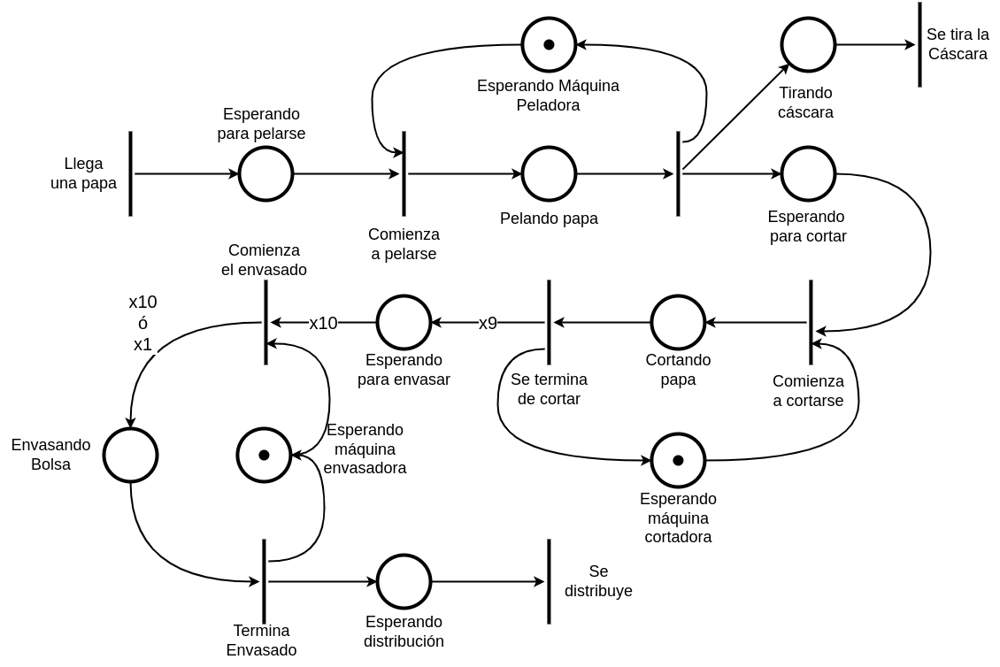

### Ejercicio 2: Fabrica de vinos.
Modelar con una Red de Petri el funcionamiento del sector de empaquetado de una fábrica de vinos. 

Los vinos llegan por dos canales distintos (vino blanco y vino tinto) y son depositados en un contenedor distinto para cada tipo de vino. Luego, debe haber 3 vinos de cada tipo para poder armar una caja. La caja puede armarse por cualquiera de los dos operarios disponibles, quienes trabajan de forma separada y solo pueden armar una caja a la vez.

Una vez finalizado el empaquetado la caja es enviada al depósito para ser despachadas.

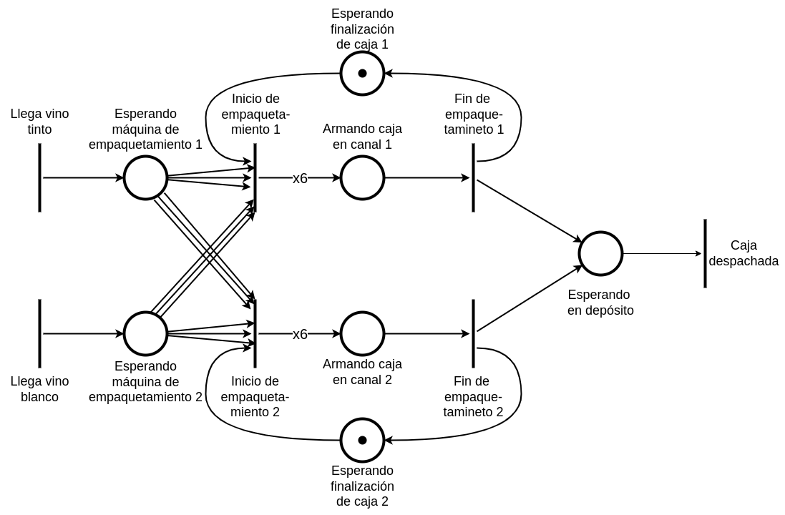

### Ejercicio 3. Peluquería.
Dos peluqueros trabajan en una peluquería. La peluquería cuenta con una sala de espera con sólo 3 sillas para que los clientes esperen por ser atendidos. Cuando alguno de los peluqueros se libera atiende a uno de los clientes de cualquiera de las sillas para cortarle el cabello, liberando la silla de la sala de espera, para que se siente un nuevo cliente. Una vez que terminó de cortarle el cabello el peluquero es liberado y puede atender a otro cliente. Finalmente los clientes deben pasar por la caja en la cual se atiende a un cliente por vez. Cuando llegan clientes y las tres sillas están ocupadas deben formar una única fila en la puerta de la peluquería.

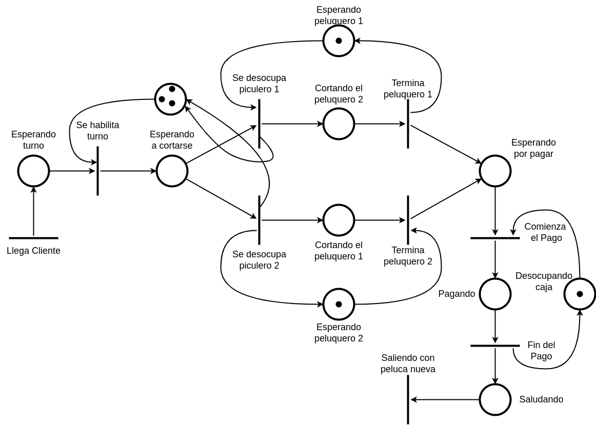

### Ejercicio 4: Estación de servicio.
Una estación de servicio cuenta con tres surtidores con sus respectivos empleados (uno por surtidor) y dos cobradores (los empleados de los surtidores no pueden cobrar).

Cuando los autos llegan, forman fila en cualquiera de los surtidores. Una vez que se terminó de cargar combustible al auto, se libera el surtidor y se pasa al sector de pago. En este sector cualquiera de los cobradores le cobra al conductor del auto. Si no hay cobradores libres, debe esperar a que uno se libere. Cuando el cobrador termina, el auto se retira de la estación y el cobrador queda libre para atender a un nuevo auto.

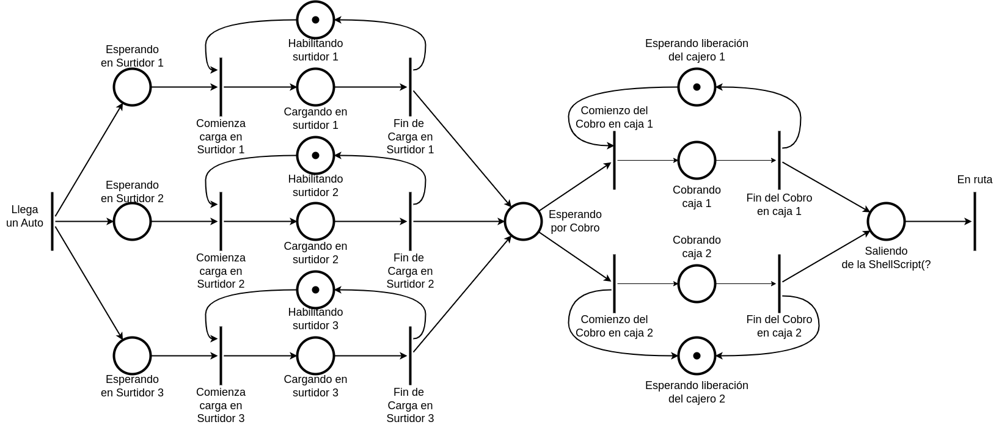

### Ejercicio 5: Voto electrónico.
Modelar una elección mediante voto electrónico, para ello se disponen de dos mesas y dos terminales de voto (una para cada mesa). A medida que los votantes llegan, forman una única fila y luego son derivados indistintamente a la mesa 1 o a la mesa 2. En cada mesa hay una autoridad para atender y tomar los datos del votante. Cada mesa atiende de a un votante a la vez. Una vez que la autoridad le tomó los datos, el votante pasa a votar a la terminal electrónica de la mesa correspondiente. Una vez que el votante emitió su voto, debe pasar a firmar que efectivamente votó, en ese mismo instante puede ingresar otra persona a la mesa. Luego, el votante que estaba firmando se retira.

### Ejercicio 6: Puente.
**a)** Modelar el pasaje de vehículos a través de un puente el cual posee una sola mano por donde pasan los vehículos. El máximo permitido es de 3 vehículos por vez.

**b)** Agregar al modelo anterior una segunda mano. Los vehículos pueden ingresar al puente por cualquiera de las dos manos y en cada puede haber un máximo de 3 vehículos a la vez.

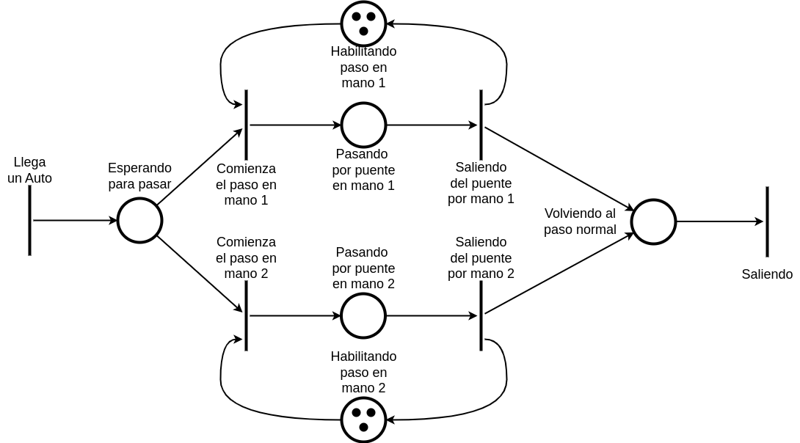

**c)** Agregar al modelo anterior la restricción de que sólo puede haber 4 vehículos en total sobre el puente.

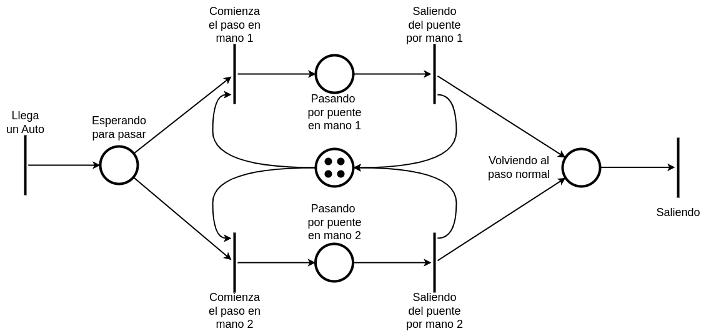

### Ejercicio 7: Puesto de trabajo.
Un puesto de trabajo recibe pedidos de dos líneas de montaje distintas. El puesto procesa los pedidos y los deriva indistintamente por uno de sus dos canales. Se procesa/deriva de a un pedido por vez.

Si el pedido es enviado a través del canal 1, se lo deposita en una cinta transportadora que lo conduce al sector de pedidos anulados, en donde un empleado les coloca el sello de anulado, se sabe que el empleado puede sellar de un pedido por vez. Una vez sellado se lo envía a un depósito de pedidos descartados, donde finalmente son retirados del puesto de trabajo.

Si el pedido es enviado a través del canal 2, se lo deposita en un contenedor que tiene una capacidad máxima de 4 pedidos. Cuando el contenedor está lleno se envían los 4 pedidos al sector de logística, donde serán finalmente despachados simultáneamente.

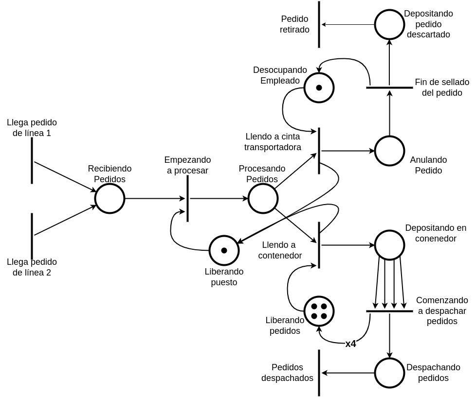

### Ejercicio 8: Alfajores.
Se desea modelar utilizando una Red de Petri el funcionamiento de una fábrica artesanal de alfajores. Esta cuenta con 3 líneas de producción, que recibe pedidos independientes, para producir alfajores con diferentes rellenos y coberturas (dulce de leche con chocolate, dulce de leche con merengue y fruta con merengue).

Cada línea de fabricación tiene un empleado que arma de a un alfajor por vez. Luego, el alfajor queda a la espera para su posterior embalaje. Una vez terminados los alfajores, deben empaquetarse en una caja de 6 unidades, con 2 alfajores de cada sabor, ya que la fábrica vende únicamente este tipo de formato.

Finalmente se envía la caja al sector de almacenamiento.

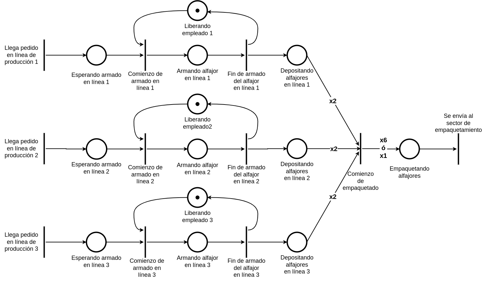

### Ejercicio 9. Mobiliaria.
Una distribuidora mobiliaria de la ciudad recibe pedidos de muebles desarmados y empaquetados, los cuales deben ser armados y ensamblados para su posterior envío y entrega a domicilio.

Los pedidos ingresan a la distribuidora por una línea única de montaje y luego son derivados al puesto A o al puesto B que posee dicha distribuidora. Allí los pedidos son analizados. Cada puesto atiende un pedido por vez. 

Luego, los pedidos pasan al depósito del sector de ensamblado para su armado y embalaje. Se sabe que en este sector hay un conjunto de empleados que trabajan juntos y van tomando los pedidos del depósito y pueden, como máximo, armar y embalar 3 pedidos simultáneamente. Una vez que el pedido está listo se lo pasa al sector de envíos en donde se esperan 5 pedidos para armar un lote que será cargado en el camión de reparto para su posterior entrega.

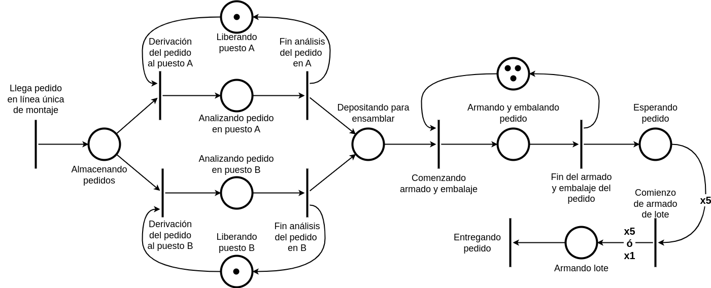

### Ejercicio 10. Juego en la escuela.
Modelar un juego en donde participan los alumnos/as de una escuela. Para comenzar el juego, se realizan dos filas pertenecientes a dos equipos, el equipo A por un lado y el equipo B por otro. Para el inicio del juego se necesitan de 6 alumnos/as, 3 del equipo A y 3 del equipo B. Una vez finalizado el juego, participan los siguientes 6 alumnos y así sucesivamente.

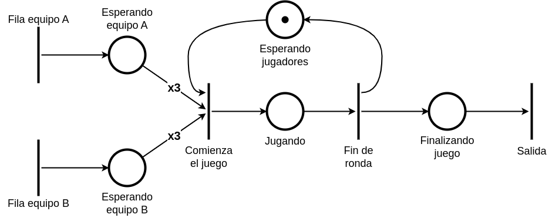

### Ejercicio 11. Fábrica de pastas.
Se desea modelar mediante una red de Petri el funcionamiento de una fábrica de pastas. La fábrica cuenta con dos líneas de producción independientes, en una se realizan canelones y en la otra se realizan sorrentinos. Por cada una de las líneas llegan porciones de masa. Existen 3 empleados que se encargan de estirar las masas y pueden trabajar en cualquiera de las dos líneas.

Una vez estiradas las masas pasan a los sectores de corte respectivos. En el caso de los canelones, de una masa se obtienen 3 canelones. En el caso de los sorrentinos, de una masa se obtienen 6 sorrentinos. En cada sector se corta de a una masa por vez.

Luego de cortadas las masas cada unidad obtenida en el corte pasa al sector de relleno. En cada sector hay una máquina que realiza esta tarea. La máquina de sorrentinos rellena tres sorrentinos al mismo tiempo, mientras que la máquina de canelones solo rellena de a uno. Finalizado el relleno, las pastas ya están listas para ser guardarlas en cajas. En el caso de los sorrentinos se arman cajas de 6 sorrentinos y en el caso de los canelones las cajas contienen 3 unidades. Una vez armadas las cajas se despachan.

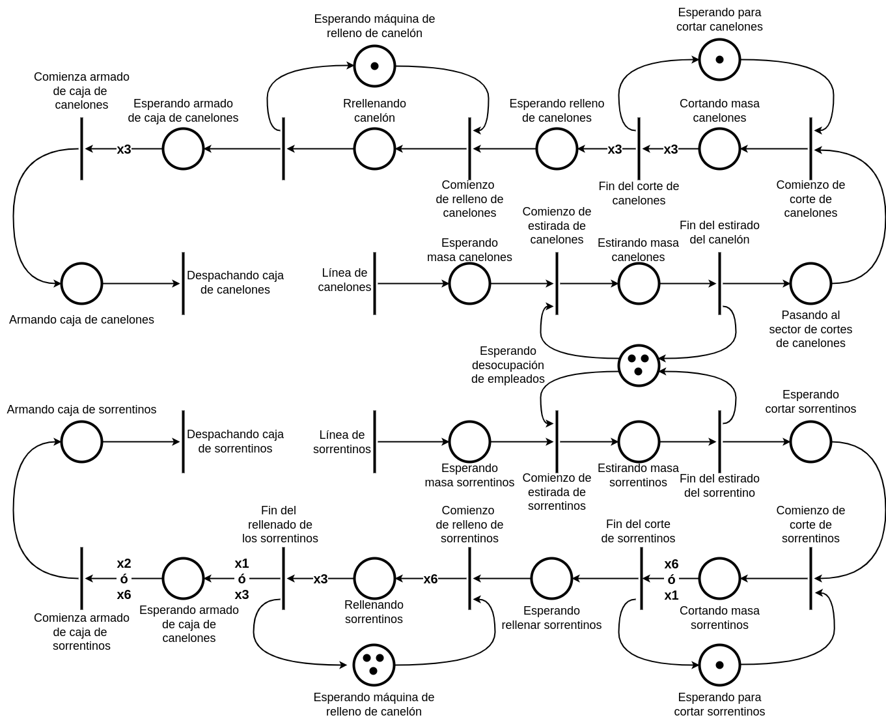
