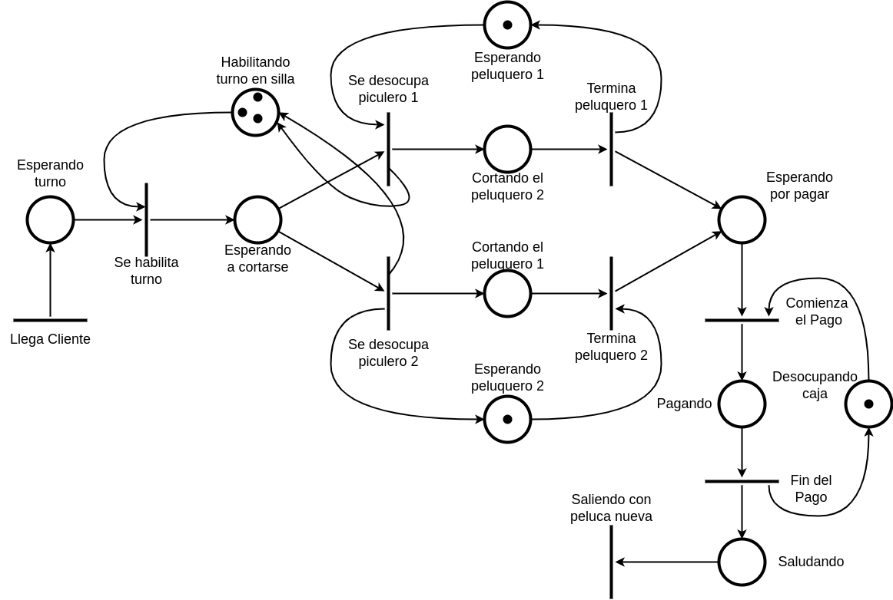

<h1 align="center">Práctica 5 - Redes de Petri</h1>

<h2>Parte 1: Teoría.</h2>
**a)** Describa qué tipos de problemas se pueden modelar utilizando Redes de Petri.

- Utilizadas para especificar problemas en tiempo real en los que son necesarios representar aspectos de concurrencia
- Permiten modelar sistemas dinámicos y concurrentes mediante una representación gráfica de eventos discretos.

**b)** Enumere y explique elementos, vistos en teoría, que se utilizan para modelar las Redes de Petri.

1. **Sitio/Lugar**: Modela un estado o una condición.
	
	
2. **Transiciones**: Modela un evento o una acción.

3. **Arco**: Relaciona un sitio con una transición o una transición con un sitio.

4. **Marca(token)**: Su función es habilitar/deshabilitar transiciones para controlar la ejecución de la red. Se colocan en los sitios. Puede haber más de uno en un sitio.

**c)** Explique que son las marcas o tokens.
-  

**d)** Explique qué significa una transición que tiene salidas pero no entradas.

- 

**e)** Explique qué significa una transición que tiene entradas pero no salidas.

<h2 align="start">Parte 2: Práctica.</h2>

### Ejercicio 1. Fábrica de papas.
Se desea modelar con Redes de Petri el funcionamiento de una fábrica de papas bastón crudas.

Las papas llegan de a una y se depositan en un contenedor común. El primer paso es pasar la papa por una máquina que quita la cáscara. Esta máquina solo puede atender de a una papa a la vez. Las papas peladas son depositadas en un contenedor común a la espera de la próxima etapa. La cáscara por su parte, es depositada en un basurero general.

Luego, cada papa cruda debe ser cortada. Para esto, la papa pasa por una máquina que corta las papas en 9 bastones. Esta máquina solo puede procesar una papa a la vez. Una vez cortados, los bastones de papas son agrupados de a 10 para ser envasados. Esto lo realiza una máquina que solo procesa una bolsa por vez. Por último, las bolsas son depositadas en un contenedor común para ser distribuidas.

### Ejercicio 2. Fabrica de vinos.
Modelar con una Red de Petri el funcionamiento del sector de empaquetado de una fábrica de vinos. 

Los vinos llegan por dos canales distintos (vino blanco y vino tinto) y son depositados en un contenedor distinto para cada tipo de vino. Luego, debe haber 3 vinos de cada tipo para poder armar una caja. La caja puede armarse por cualquiera de los dos operarios disponibles, quienes trabajan de forma separada y solo pueden armar una caja a la vez.

Una vez finalizado el empaquetado la caja es enviada al depósito para ser despachadas.

### Ejercicio 3. Peluquería.
Dos peluqueros trabajan en una peluquería. La peluquería cuenta con una sala de espera con sólo 3 sillas para que los clientes esperen por ser atendidos. Cuando alguno de los peluqueros se libera atiende a uno de los clientes de cualquiera de las sillas para cortarle el cabello, liberando la silla de la sala de espera, para que se siente un nuevo cliente. Una vez que terminó de cortarle el cabello el peluquero es liberado y puede atender a otro cliente. Finalmente los clientes deben pasar por la caja en la cual se atiende a un cliente por vez. Cuando llegan clientes y las tres sillas están ocupadas deben formar una única fila en la puerta de la peluquería.

### Ejercicio 4. Estación de servicio.
Una estación de servicio cuenta con tres surtidores con sus respectivos empleados (uno por surtidor) y dos cobradores (los empleados de los surtidores no pueden cobrar).

Cuando los autos llegan, forman fila en cualquiera de los surtidores. Una vez que se terminó de cargar combustible al auto, se libera el surtidor y se pasa al sector de pago. En este sector cualquiera de los cobradores le cobra al conductor del auto. Si no hay cobradores libres, debe esperar a que uno se libere. Cuando el cobrador termina, el auto se retira de la estación y el cobrador queda libre para atender a un nuevo auto.

### Ejercicio 5. Voto electrónico.
Modelar una elección mediante voto electrónico, para ello se disponen de dos mesas y dos terminales de voto (una para cada mesa). A medida que los votantes llegan, forman una única fila y luego son derivados indistintamente a la mesa 1 o a la mesa 2. En cada mesa hay una autoridad para atender y tomar los datos del votante. Cada mesa atiende de a un votante a la vez. Una vez que la autoridad le tomó los datos, el votante pasa a votar a la terminal electrónica de la mesa correspondiente. Una vez que el votante emitió su voto, debe pasar a firmar que efectivamente votó, en ese mismo instante puede ingresar otra persona a la mesa. Luego, el votante que estaba firmando se retira.

### Ejercicio 7. Puesto de trabajo.

