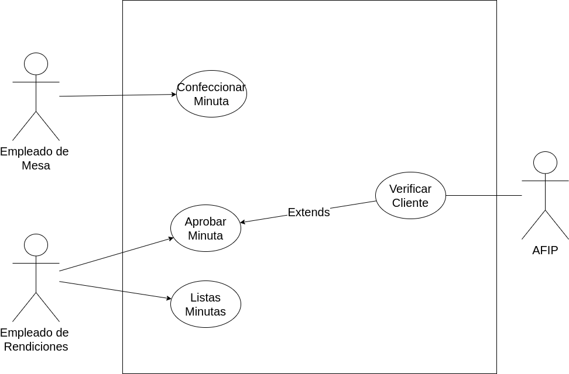

## Problema 03: Contratos.

___

**Actores:**

- Empleado de mesa

- Empleado de rendiciones

- Servidor externo

**Casos de Usos**

- Confeccionar minuta

- Aprobar minuta

- Verificar CUIT

___

**Nombre del caso de uso:**

- Confeccionar minuta

**Descripción:**

- Este Caso de Uso describe el evento en el que el Empleado de mesa confecciona una minuta

**Actores:** 

- Empleado de mesa

**Precondiciones:**

- 

**Curso Normal:**

- **Acción del Actor:**

	- Paso 1: El empleado selecciona la opción de "Generar minuta"
	
	- Paso 3: el empleado ingresa los datos requeridos por el sistema
	
	- Paso 5: el empleado ingresa el monto y los meses

- **Acciones del Sistema:**

	- Paso 2: el sistema solicita los datos de la persona: nombre y CUIT
	
	- Paso 4: el sistema solicita el monto del contrato y la duración en meses
	
	- Paso 6: el sistema verifica que el monto del contrato sea menor a $25000
	
	- Paso 7: el sistema verifica que la duración del contrato sea menor a 6 meses
	
	- Paso 8: el sistema registra la minuta y le asocia un número único.

**Curso Alterno:**

- Paso alternativo 6: el monto del contrato es mayor a 25000. Se notifica y se vuelve al paso 4

- Paso alternativo 7: la duración del contrato no es menor a 6 meses. Se notifica y se vuelve al paso 4

**Postcondición:**

- Se confecciona una minuta.
___

**Nombre del caso de uso:**

- Aprobar minuta.

**Descripción:**

- Este Caso de Uso describe el evento en el que el Empleado de rendiciones aprueba una minuta.

**Actores:** 

- Empleado de rendiciones.

**Precondiciones:**

- 

**Curso Normal:**

- **Acción del Actor:**

	- Paso 1: El empleado de rendiciones selecciona "Aprobar minuta"
	
	- Paso 3: el empleado ingrese el número de minuta

- **Acciones del Sistema:**

	- Paso 2: El sistema solicita que se ingrese un número de minuta
	
	- Paso 4: el sistema valida el número de minuta
	
	- Paso 5: el sistema verifica que la persona a contratar no tenga más de 3 contratos vigentes
	
	- Paso 6: el sistema ejecuta el Caso de Uso "Verificar CUIT"
	
	- Paso 7: el sistema aprueba la minuta y la registra como aprobada.
	
	- 

**Curso Alterno:**

- Paso alternativo 4: Número de minuta incorrecto. Se notifica y termina CU.

- Paso alternativo 5: La persona posee más de 3 contratos vigente. Se notifica y termina el CU.

- Paso alternativo 6:

**Postcondición:**

- Se aprueba una minuta.

___

**Nombre del caso de uso:**

- Verificar CUIT

**Descripción:**

- Este Caso de Uso desribe el evento en el que se verifica el CUIT en la AFIP 

**Actores:** 

- Servidor de AFIP

**Precondiciones:**

- Haber ejecutado el Caso de Uso "Aprobar minuta"

**Curso Normal:**

- **Acción del Actor:**
	
	- Paso 2: el servidor acepta la conección y valida el token
	
	- Paso 3: el servidor solicita el número de CUIT
	
	- Paso 5: el servidor valida el número de CUIT
	
	- Paso 6: el servidor retorna el estado del CUIT
	
- **Acciones del Sistema:**

	- Paso 1: El sistema solicita la conección con el Servidor de AFIP y envía el token único
	
	- Paso 4: el sistema envía el número de CUIT
	
	- Paso 7: el sistema recibe que el CUIT está habilitado
	
	- Paso 8: se cierra la conección con el servidor externo.

**Curso Alterno:**

- Paso alternativo 1: No se establece conección. Se notifica y termina CU.

- Paso alternativo 2: el token es incorrecto. Se informa y finaliza el CU.

- Paso alternativo 7: El CUIT no está habilitado. Se notifica y termina el CU

**Postcondición:**

- Se hace la verificación del CUIT

___

**Nombre del caso**

- Listar Minutas

**Descripción**

- Este Caso de Uso especifica el evento en el cual el Empleado de rendiciones imprime un listado con las minutas aprobadas.

**Actores**

- Empleado de Rendiciones

**Precondiciones**

**Curso Normal:**

- **Acción del Actor:**

	- Paso 1: El empleado de rendiciones selecciona la opción de: "Imprimir Minutas"
	

- **Acciones del Sistema:**

	- Paso 2: el sistema imprime un listado con las minutas aprobadas.
	

**Curso Alterno:**

- Paso alternativo 2: no hay minutas aprobadas. Se informa y termina el CU.

**Postcondición:**

- Se listan minutas aprobadas.

___
