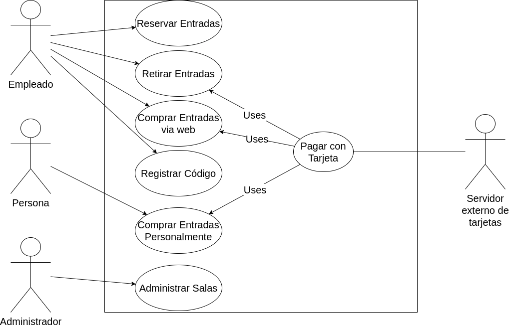

## Problema 06: Venta de Entradas para Teatro.

**Actores:**

- Empleado

- Usuario

- Servidor Externo de tarjetas

- Administrador

**Casos de Usos**

- Reservar Entradas

- Comprar Entradas via Web

- Comprar Entradas Personalmente

- Retirar Entradas

- Verificar Código	

- Pagar con Tarjeta

___

**Nombre del caso**

- Reservar Entradas

**Descripción**

- Este Caso de Uso describe el evento en el que un Empleado hace la reserva de entradas.

**Actores**

- Empleado

**Precondiciones**

- Ninguna

**Curso Normal:**

- **Acción del Actor:**

	- Paso 2: el Empleado ingresa los datos de la persona
	
	- Paso 4: el Empleado selecciona una opción	
	
	- Paso 6: el empleado ingresa la cantidad de entradas

- **Acciones del Sistema:**

	- Paso 1: El Sistema solicita los datos de la persona
	
	- Paso 3: el Sistema muestra una grilla de funciones disponibles
	
	- Paso 5: el sistema solicita la cantidad de entradas
	
	- Paso 7: el sistema verifica la cantidad de entradas de la persona
	
	- Paso 8: el sistema registra la reserva de las entradas.
	

**Curso Alterno:**

- Paso alternativo 3: No hay funciones disponibles. Se informa y termina el Caso de Uso.

- Paso alternativo 7: la cantidad de entradas de la persona superan el máximo de 2. Se notifica y se termina el CU

**Postcondición:**

- Se hace la reserva de entradas

___

**Nombre del caso**

- Comprar Entradas via Web

**Descripción**

- Este Caso de Uso describe el evento en el que un Usuario elige una función e ingresa sus datos para comprar entradas

**Actores**

- Usuario

**Precondiciones**

- No hay

**Curso Normal:**

- **Acción del Actor:**

	- Paso 1: El Usuario selecciona la opción de "Comprar Entradas"
	
	- Paso 3: el Usuario selecciona la opción disponible
	
	- Paso 5: el Usuario ingresa los datos solicitados
	
	- Paso 7: el Usuario selecciona los lugares disponibles
	
	- Paso 8: el Usuario selecciona la opción de "Pagar"

- **Acciones del Sistema:**

	- Paso 2: el Sistema muestra la grilla de funciones disponibles
	
	- Paso 4: el Sistema solicita los datos del Usuario
	
	- Paso 6: el Sistema muestra los lugares disponible
	
	- Paso 9: el Sistema ejecuta el Caso de Uso "Pagar con Tarjeta"
	
	- Paso 10: el Sistema registra la compra de las entradas y emite un código de compra.
	

**Curso Alterno:**

- Paso alternativo 2: No hay funciones disponibles. Se notifica y se termina el Caso de Uso.

- Paso alternativo 6: No hay lugares disponibles. Se notifica y se termina el Caso de Uso.

- Paso alternativo 9: No se realiza el pago. Se notifica y se termina el Caso de Uso.

**Postcondición:**

- Se emite un código de compra para retirar las entradas.

___

**Nombre del caso**

- Comprar Entradas Personalmente.

**Descripción**

- Este Caso de Uso describe el evento en el que un Empleado solicita los datos de una persona para la compra de las entradas.

**Actores**

- Empleado

**Precondiciones**

- No hay

**Curso Normal:**

- **Acción del Actor:**

	- Paso 1: El Empleado selecciona la opción de "Vender Entradas"
	
	- Paso 3: el empleado selecciona una función
	
	- Paso 5: el empleado ingresa los datos solicitados
	
	- Paso 7: el empleado selecciona los lugares disponibles
	
	- Paso 8: el empleado selecciona la opción de "Pagar"

- **Acciones del Sistema:**

	- Paso 2: el sistema muestra una grilla con las funciones disponibles
	
	- Paso 4: el Sistema solicita los datos de la persona
	
	- Paso 6: el Sistema muestra los lugares disponible
	
	- Paso 9: el Sistema ejecuta el Caso de Uso "Pagar con Tarjeta"
	
	- Paso 10: el Sistema registra la compra de las entradas y emite un código de compra.

**Curso Alterno:**

**Postcondición:**

___

**Nombre del caso**

- Retirar Entradas

**Descripción**

- Este Caso de Uso describe el evento en el que se compran las entradas reservadas

**Actores**

- Empleado

**Precondiciones**

**Curso Normal:**

- **Acción del Actor:**

	- Paso 1: El Empleado selecciona "Retirar Entradas"

	- Paso 3: el empleado ingresa los datos de la persona
	

- **Acciones del Sistema:**

	- Paso 2: El sistema solicita los datos de la persona
	
	- Paso 4: el sistema valida que la persona registre entradas
	
	- Paso 5: el sistema valida el horario antes de la función
	
	- Paso 6: el sistema ejecuta el Caso de Uso "Pagar con Tarjeta"
	
	- Paso 7: el sistema imprime las entradas compradas

**Curso Alterno:**

- Paso alternativo 4: la persona no registra entradas. Se notifica y finaliza el Caso de Uso.

- Paso alternativo 5: las entradas están caducadas. Se notifica y finaliza el Caso de Uso.

**Postcondición:**

- Se compran las entradas reservadas.

___

**Nombre del caso**

- Verificar Código

**Descripción**

- Este Caso de Uso describe el evento en el que el Empleado verifica el código de retiro de entradas

**Actores**

- Empleado

**Precondiciones**

**Curso Normal:**

- **Acción del Actor:**

	- Paso 1: El Empleado selecciona la opción de "Verificar Código"
	
	- Paso 3: el empleado ingresa el código

- **Acciones del Sistema:**

	- Paso 2: el sistema solicita el código
	
	- Paso 4: el sistema verifica el código ingresado
	
	- Paso 5: el sistema imprime las entradas

**Curso Alterno:**

- Paso alternativo 4: el código ingresado es incorrecto. Se notifica y termina CU.

**Postcondición:**

- Se imprimen las entradas

___

**Nombre del caso**

- Pagar con Tarjeta

**Descripción**

- Este Caso de Uso describe el evento en el que se paga por la compra de entradas

**Actores**

- Servidor Externo de tarjetas.

**Precondiciones**

- Haber ejecutado el CU "Comprar Entradas vía Web" o "Comprar Entradas Personalmente"

**Curso Normal:**

- **Acción del Actor:**

	-
	
	-

- **Acciones del Sistema:**

	-
	
	-

**Curso Alterno:**

**Postcondición:**

- Se hace el pago de las entradas

___

**Nombre del caso**

- Administrar Salas

**Descripción**

- Este Caso de Uso describe el evento en el que se cargan las obras en la grilla

**Actores**

- Administrador de Salas

**Precondiciones**

**Curso Normal:**

- **Acción del Actor:**

	-
	
	-

- **Acciones del Sistema:**

	-
	
	-

**Curso Alterno:**

**Postcondición:**

- Se Carga una obra en la grilla

